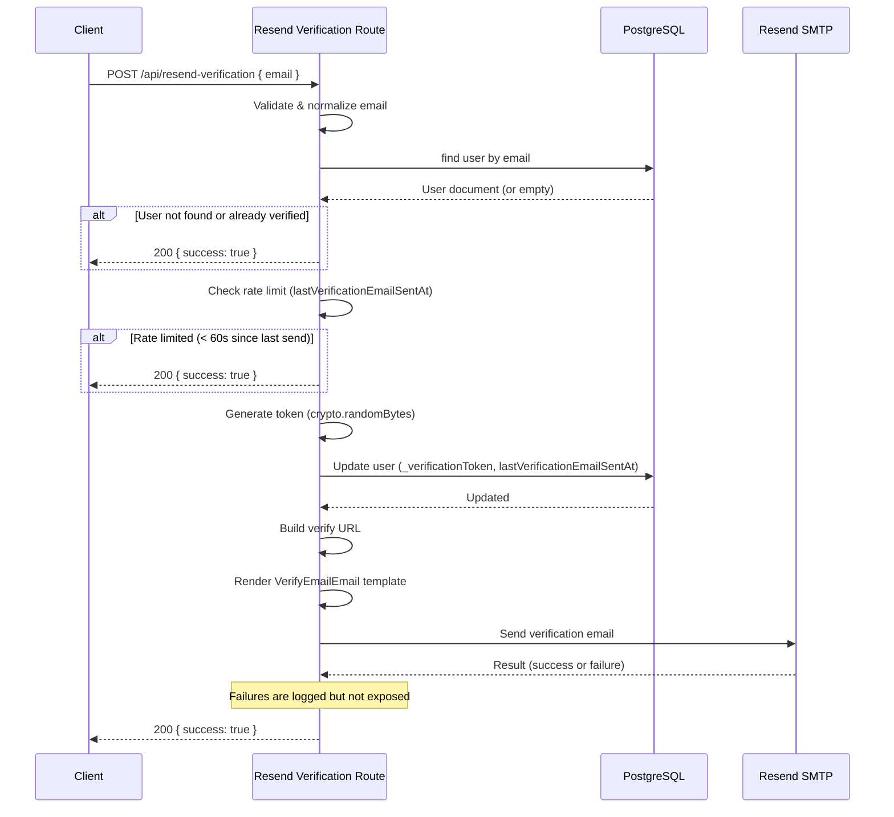

# Resend Verification API

## Overview

The Resend Verification API allows unauthenticated users to request a new email verification link. It is designed with security as a priority -- all responses return the same success shape regardless of whether the email exists or is already verified, preventing email enumeration attacks.

**Endpoint:** `POST /api/resend-verification`

**Source:** `src/app/(app)/api/resend-verification/route.ts`

## Request

### Headers

No authentication required. This is a public endpoint.

### Request Body

```json
{
  "email": "user@example.com"
}
```

| Field | Type | Required | Description |
|---|---|---|---|
| `email` | `string` | Yes | The email address to resend verification to. Automatically lowercased and trimmed. |

## Behavior

### Normal Flow

1. Look up the user by email address.
2. If the user does not exist or is already verified, return success silently (prevents enumeration).
3. Check rate limiting -- if the last verification email was sent less than 60 seconds ago, return success silently.
4. Generate a new verification token using `crypto.randomBytes(20).toString('hex')`.
5. Update the user record with the new `_verificationToken` and `lastVerificationEmailSentAt` timestamp.
6. Build the verification URL: `{serverUrl}/verify-email?token={token}`.
7. Render the verification email using the `VerifyEmailEmail` React Email component.
8. Send the email via Payload's `sendEmail()` method.
9. Return success (even if the email send fails -- errors are logged server-side).

### Security Design Decisions

| Decision | Rationale |
|---|---|
| **Uniform response** | Always returns `{ success: true }` regardless of outcome, preventing attackers from discovering valid email addresses. |
| **Silent rate limiting** | Rate-limited requests return success without indication, preventing timing-based enumeration. |
| **Error suppression** | Email send failures are logged server-side but not exposed to the client. |
| **Email normalization** | Input is lowercased and trimmed to prevent case-sensitivity bypass attempts. |

## Rate Limiting

The endpoint implements per-user rate limiting using a persisted timestamp on the user record:

| Parameter | Value |
|---|---|
| **Window** | 60 seconds (60,000 ms) |
| **Mechanism** | `lastVerificationEmailSentAt` field on user document |
| **Scope** | Per email address |

```ts
const RATE_LIMIT_MS = 60_000 // 1 request per minute per email
```

If a request arrives within the rate limit window, the endpoint returns `{ success: true }` without generating a new token or sending an email.

## Response

### Success Response

**200 OK** -- Always returned (regardless of actual outcome):

```json
{
  "success": true
}
```

### Error Responses

| Status | Error Message | Cause |
|---|---|---|
| 400 | `Invalid request body` | Malformed JSON |
| 400 | `email is required` | Missing or non-string `email` field |

:::info
Note that only input validation errors produce error responses. All business logic outcomes (user not found, already verified, rate limited, email send failure) return a 200 success to prevent information leakage.
:::

## Sequence Diagram



## Token Generation

Verification tokens are generated using Node.js `crypto.randomBytes()`:

```ts
const token = crypto.randomBytes(20).toString('hex')
```

This produces a 40-character hexadecimal string with 160 bits of entropy, making brute-force attacks infeasible.

The token is stored on the user document in the `_verificationToken` field and included in the verification URL as a query parameter.

## Verification URL

The verification link sent to the user follows this format:

```
https://ocfcrews.org/verify-email?token=<40-character-hex-token>
```

The server URL is determined by `getServerSideURL()`, which reads from the environment configuration.
