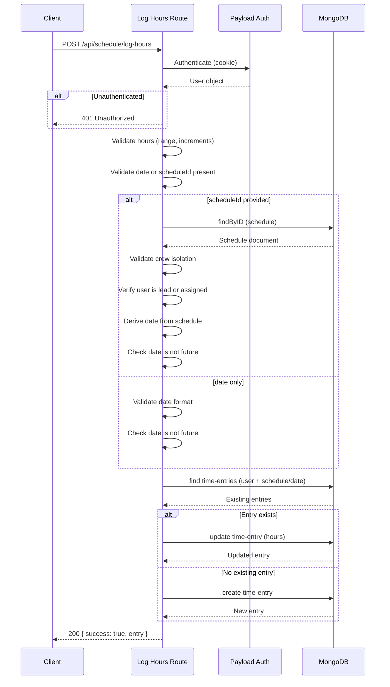

# Log Hours API

## Overview

The Log Hours API allows authenticated crew members to log hours worked for a specific schedule shift or a standalone date. It uses an **upsert pattern** -- if a time entry already exists for the user and shift/date combination, it updates the hours; otherwise, it creates a new entry.

**Endpoint:** `POST /api/schedule/log-hours`

**Source:** `src/app/(app)/api/schedule/log-hours/route.ts`

## Request

### Headers

| Header | Required | Description |
|---|---|---|
| `Cookie` | Yes | Payload session cookie for authentication |

### Request Body

```json
{
  "scheduleId": "string (optional)",
  "date": "YYYY-MM-DD (optional, required if scheduleId absent)",
  "hours": 4.5
}
```

| Field | Type | Required | Description |
|---|---|---|---|
| `scheduleId` | `string` | Conditional | The ID of the schedule document. Optional -- if provided, the date is derived from the schedule. |
| `date` | `string` | Conditional | A date in `YYYY-MM-DD` format. Required when `scheduleId` is not provided. |
| `hours` | `number` | Yes | Hours worked. Must be between 0 and 24 (inclusive), in 0.5-hour increments. |

At least one of `scheduleId` or `date` must be provided.

## Validation Rules

1. **Authentication** -- The user must be logged in.
2. **Hours range** -- Must be a finite number between 0 and 24.
3. **Half-hour increments** -- Hours must be in 0.5 increments (e.g., 0, 0.5, 1, 1.5, ..., 24). Validated with: `Math.round(hours * 2) / 2 !== hours`.
4. **Date or schedule required** -- At least one of `scheduleId` or `date` must be provided.
5. **Date format** -- If `date` is provided, it must match `YYYY-MM-DD` and be a valid calendar date.
6. **No future dates** -- Cannot log hours for a date in the future (compared as UTC date strings).
7. **30-day cutoff** -- Cannot log hours for dates more than 30 days in the past. This applies to both standalone dates and schedule-linked entries.
8. **Crew membership** -- The user must belong to a crew.
9. **Schedule crew isolation** -- If `scheduleId` is provided, the user's crew must match the schedule's crew.
10. **Assignment check** -- If `scheduleId` is provided, the user must be either a lead or assigned to a position on that shift.

## Upsert Logic

The endpoint uses a "find then create-or-update" pattern:

### Special case: `hours = 0`

When `hours` is `0`:
- If an existing time entry is found, it is **deleted** (to keep the user's hours aggregate clean). Returns `{ success: true, entry: null }`.
- If no existing entry is found, this is a no-op. Returns `{ success: true, entry: null }`.

### With `scheduleId`

1. Finds an existing time entry where `user` equals the current user AND `schedule` equals the provided schedule ID.
2. If found, updates the `hours` field (or deletes if `hours = 0`).
3. If not found, creates a new time entry with `user`, `schedule`, `crew`, `date` (derived from schedule), and `hours`.

### Without `scheduleId` (standalone date)

1. Finds an existing time entry where `user` equals the current user AND `date` equals the provided date AND `schedule` does not exist.
2. If found, updates the `hours` field (or deletes if `hours = 0`).
3. If not found, creates a new time entry with `user`, `crew`, `date`, and `hours` (no schedule reference).

## Response

### Success Response

**200 OK** -- Hours logged or updated:

```json
{
  "success": true,
  "entry": {
    "id": "time-entry-id",
    "user": "user-id",
    "schedule": "schedule-id or null",
    "crew": "crew-id",
    "date": "2025-07-15",
    "hours": 4.5
  }
}
```

### Error Responses

| Status | Error Message | Cause |
|---|---|---|
| 400 | `Invalid request body` | Malformed JSON |
| 400 | `hours must be between 0 and 24` | Hours out of range or non-finite |
| 400 | `hours must be in 0.5-hour increments` | Hours not on a half-hour boundary |
| 400 | `scheduleId or date is required` | Neither field provided |
| 400 | `date must be a valid date in YYYY-MM-DD format` | Invalid date string |
| 400 | `Cannot log hours for future dates` | Standalone date in the future |
| 400 | `Cannot log hours for dates more than 30 days ago` | Standalone date beyond the 30-day cutoff |
| 400 | `Cannot log hours for future shifts` | Schedule date in the future |
| 400 | `Cannot log hours for shifts more than 30 days ago` | Schedule date beyond the 30-day cutoff |
| 401 | `Unauthorized` | Not authenticated |
| 403 | `User is not in a crew` | User has no crew association |
| 403 | `Forbidden: not in this crew` | User's crew does not match schedule's crew |
| 403 | `Forbidden: not assigned to this shift` | User is not a lead or assigned member |
| 404 | `Schedule not found` | Schedule ID does not exist |
| 500 | `Failed to save hours` | Database write error |

## Sequence Diagram



## Examples

### Log hours for a specific shift

```ts
const response = await fetch('/api/schedule/log-hours', {
  method: 'POST',
  headers: { 'Content-Type': 'application/json' },
  body: JSON.stringify({
    scheduleId: '665abc123def456',
    hours: 6,
  }),
})
```

### Log hours for a standalone date

```ts
const response = await fetch('/api/schedule/log-hours', {
  method: 'POST',
  headers: { 'Content-Type': 'application/json' },
  body: JSON.stringify({
    date: '2025-07-15',
    hours: 3.5,
  }),
})
```
