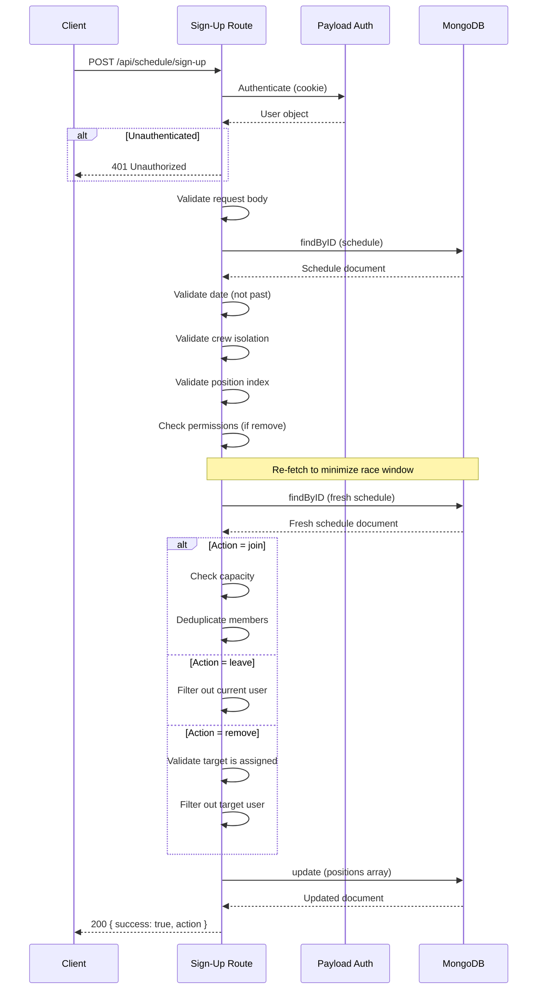

# Schedule Sign-Up API

## Overview

The Schedule Sign-Up API allows authenticated crew members to join, leave, or be removed from schedule positions. It enforces crew isolation, past-shift guards, capacity limits, and role-based permissions.

**Endpoint:** `POST /api/schedule/sign-up`

**Source:** `src/app/(app)/api/schedule/sign-up/route.ts`

## Request

### Headers

| Header | Required | Description |
|---|---|---|
| `Cookie` | Yes | Payload session cookie for authentication |

### Request Body

```json
{
  "shiftId": "string",
  "positionIndex": 0,
  "action": "join | leave | remove",
  "targetUserId": "string (required for 'remove', optional for 'join')",
  "force": false
}
```

| Field | Type | Required | Description |
|---|---|---|---|
| `shiftId` | `string` | Yes | The ID of the schedule document. |
| `positionIndex` | `integer` | Yes | Zero-based index of the position within the schedule's `positions` array. |
| `action` | `string` | Yes | One of `join`, `leave`, or `remove`. |
| `targetUserId` | `string` | Only for `remove`; optional for `join` | The user ID to remove from the position. Required when `action` is `remove`. For `join`, privileged users can specify this to assign another member. |
| `force` | `boolean` | No | When `true` and the user is privileged, skips conflict detection checks (availability and same-day shift warnings). Default `false`. |

**Rate limit:** 20 requests per 60 seconds per user.

## Validation Rules

1. **Authentication** -- The user must be logged in.
2. **Body parsing** -- The request body must be valid JSON with all required fields.
3. **Field types** -- `shiftId` must be a non-empty string, `positionIndex` must be a non-negative integer, `action` must be one of the three valid values.
4. **Schedule existence** -- The schedule document must exist.
5. **Crew isolation** -- The authenticated user's crew must match the schedule's crew.
6. **Locked shift guard** -- If the shift is locked, returns 403 regardless of action or role.
7. **Position bounds** -- The `positionIndex` must be within the bounds of the schedule's positions array.
8. **Leave permissions** -- For `leave` actions, the user must be privileged (`admin`, `editor`, `crew_coordinator`, or `crew_leader`) or be a shift lead. Regular members receive a 403 error instructing them to contact their coordinator.
9. **Remove permissions** -- For `remove` actions, the user must be privileged (`admin`, `editor`, `crew_coordinator`, or `crew_leader`) or be a shift lead.
10. **Target user validation** -- For `join` with `targetUserId`, privileged users can assign other crew members. The target user must belong to the same crew.
11. **Conflict detection** -- For `join` actions (unless `force=true` by a privileged user), the endpoint checks for scheduling conflicts:
    - Whether the user is marked as unavailable on the shift date
    - Whether the user is already assigned to another shift on the same date
    - If conflicts are found, returns `{ requiresConfirmation: true, warnings: [...] }` instead of performing the join (see below).
12. **Lead-on-shift guard** -- Non-privileged users who are already a lead on the shift cannot join a position (409 Conflict).
13. **Other-position guard** -- Non-privileged users already assigned to another position on the same shift cannot join (409 Conflict).
14. **Capacity check** -- For `join` actions by non-privileged users, the position must have fewer than 1 assigned member. Privileged users can double-staff a position.
15. **Target validation** -- For `remove` actions, the `targetUserId` must actually be assigned to the position.

## Race Condition Handling

The endpoint re-fetches the schedule immediately before writing to minimize the race window between the capacity check and the write. This "double-read" pattern reduces the chance of double-staffing to sub-millisecond timing:

1. Initial fetch validates the schedule exists, crew membership, and date constraints.
2. A second fetch retrieves the latest position data immediately before mutation.
3. The updated positions array is written atomically.

Additionally, `join` actions deduplicate using a `Set` to guard against the same user submitting twice in rapid succession.

## Response

### Success Responses

**200 OK** -- Action completed successfully:

```json
{
  "success": true,
  "action": "join | leave | remove"
}
```

**200 OK** -- User already assigned (idempotent join):

```json
{
  "success": true,
  "action": "already_joined"
}
```

**200 OK** -- Conflict detection requires confirmation (not an error):

```json
{
  "requiresConfirmation": true,
  "warnings": [
    "This member is marked as unavailable on this date.",
    "This member is already signed up for \"Dinner\" on this date."
  ]
}
```

When this response is returned, the join was **not** performed. The client should display the warnings to the user and re-submit with `force: true` (privileged users only) to proceed.

### Error Responses

| Status | Error Message | Cause |
|---|---|---|
| 400 | `Invalid request body` | Malformed JSON |
| 400 | `Missing or invalid required fields` | Missing/invalid `shiftId`, `positionIndex`, or `action` |
| 400 | `Invalid targetUserId` | `targetUserId` is not a valid non-empty string |
| 400 | `targetUserId required for remove` | `remove` action without `targetUserId` |
| 400 | `Invalid position index` | `positionIndex` out of bounds |
| 400 | `User is not assigned to this position` | `remove` target not found in position |
| 401 | `Unauthorized` | Not authenticated |
| 403 | `Forbidden: not in this crew` | User's crew does not match schedule's crew |
| 403 | `This shift is locked and cannot be modified.` | Shift is locked |
| 403 | `You cannot leave a shift on your own...` | Non-privileged user attempting `leave` |
| 403 | `Forbidden: insufficient permissions` | Non-privileged user attempting `remove` |
| 403 | `Target user is not in this crew` | `targetUserId` belongs to a different crew |
| 404 | `Schedule not found` | Schedule ID does not exist |
| 404 | `Target user not found` | `targetUserId` does not exist |
| 409 | `This position is already filled.` | Non-privileged user joining a filled position |
| 409 | `You are already a lead on this shift` | Non-privileged user who is a lead trying to join a position |
| 409 | `You are already assigned to another position on this shift` | Non-privileged user already on another position |
| 409 | `Shift was just modified. Please try again.` | Optimistic lock failure (concurrent modification) |
| 429 | `Too many requests` | Rate limit exceeded (20 req/60s) |
| 500 | `Failed to update schedule` | Database write error |

## Sequence Diagram



## Action Behavior

### `join`

- Adds the authenticated user (or `targetUserId` if specified by a privileged user) to the position's `assignedMembers` array.
- If the user is already assigned, returns `{ action: "already_joined" }` without modifying data.
- Non-privileged users are blocked if the position already has 1 or more members (409 Conflict).
- Privileged users (`admin`, `editor`, `crew_coordinator`, `crew_leader`) can join even if the position is filled, enabling double-staffing.
- Unless `force=true` is set by a privileged user, the endpoint performs conflict detection (unavailability and same-day shift checks) before joining. Conflicts return `{ requiresConfirmation: true, warnings }` instead of performing the action.
- Non-privileged users who are already a lead on the shift or assigned to another position on the same shift are blocked with 409.

### `leave`

- Removes the authenticated user from the position's `assignedMembers` array.
- **Restricted to privileged users** (`admin`, `editor`, `crew_coordinator`, `crew_leader`) **and shift leads only**. Regular members receive a 403 error instructing them to contact their crew coordinator.
- Silently succeeds even if the user was not assigned (the filter simply has no effect).

### `remove`

- Removes the specified `targetUserId` from the position.
- Requires the requester to be privileged or a shift lead.
- Returns 400 if the target user is not currently assigned to the position.
