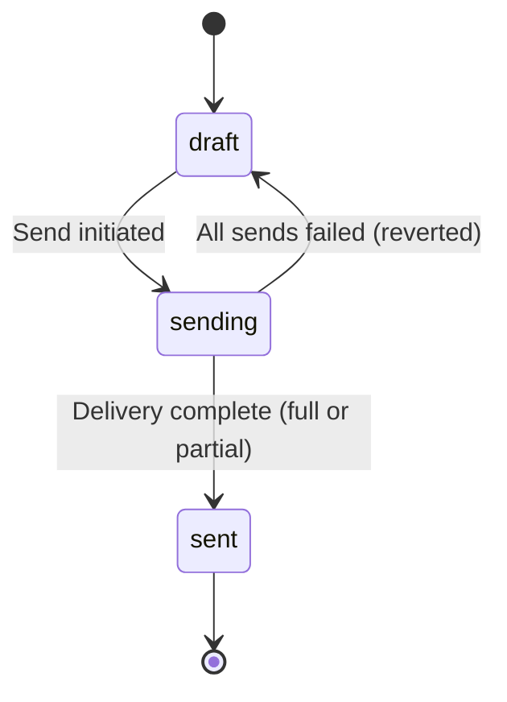
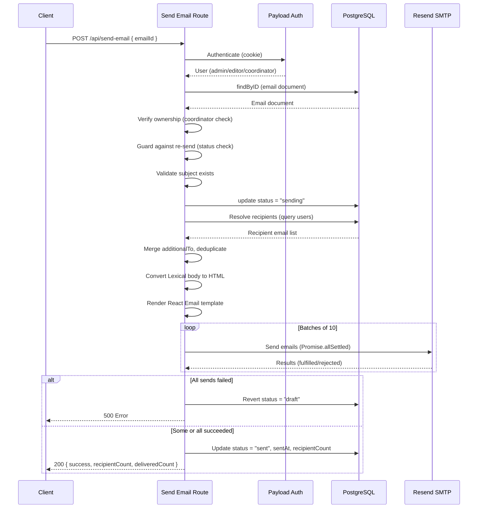

# Send Email API

## Overview

The Send Email API triggers the delivery of an email campaign that has been composed in the admin panel. It resolves recipients based on the email document's `recipientType`, renders the email body from Lexical rich text to HTML, and sends emails in batches through the configured SMTP transport (Resend).

**Endpoint:** `POST /api/send-email`

**Source:** `src/app/(app)/api/send-email/route.ts`

## Request

### Headers

| Header | Required | Description |
|---|---|---|
| `Cookie` | Yes | Payload session cookie for authentication |

### Request Body

```json
{
  "emailId": "string"
}
```

| Field | Type | Required | Description |
|---|---|---|---|
| `emailId` | `string` | Yes | The ID of the email document in the `emails` collection. |

## Authentication & Authorization

The caller must be authenticated and have one of the following roles:

- `admin` -- Full access, can send to any recipient type including `all_users`.
- `editor` -- Can send to all recipient types except `all_users`.
- `crew_coordinator` -- Can only send emails scoped to their own crew. Cannot send to `all_users` or `all_crew_members` (the latter is silently redirected to `specific_crew` via the `beforeChange` hook).

Coordinators are also restricted from sending emails that belong to a different crew (verified by comparing the email document's `specificCrew` with the user's crew).

## Recipient Resolution

Recipients are resolved based on the email document's `recipientType` field:

| Recipient Type | Description | Who Can Use | Query |
|---|---|---|---|
| `all_users` | All registered users | Admin only | All users (limit 1000) |
| `all_crew_members` | All users with a crew role other than `other` | Admin, editor | Users where `crewRole != 'other'` (limit 1000) |
| `specific_crew` | All members of a specific crew | Admin, editor, coordinator (own crew only) | Users where `crew == specificCrew` (limit 500) |
| `manual` | Manually entered email addresses | Admin, editor, coordinator | Email addresses from the `manualRecipients` array |

After resolving the primary recipients, the endpoint merges in any `additionalTo` addresses and deduplicates the combined list.

:::warning Truncation
If the number of matching users exceeds the query limit (1000 for all_users/all_crew_members, 500 for specific_crew), the recipient list is truncated. A warning is included in the response, and a server log is emitted.
:::

## Status Transitions

The email document goes through the following status transitions during sending:



| Status | Description |
|---|---|
| `draft` | Initial state. Email can be edited and sent. |
| `sending` | Locked state during delivery. Prevents concurrent send attempts. |
| `sent` | Final state. Email has been delivered (fully or partially). |

## Batch Sending

Emails are sent in **batches of 10** using `Promise.allSettled()`. This approach:

- Prevents overwhelming the SMTP transport with too many simultaneous connections.
- Allows partial success -- individual failures do not block other recipients.
- Tracks failure counts for reporting.

If **all** sends fail, the email status is reverted to `draft` and a 500 error is returned. If some succeed, the email is marked as `sent` with the failure count included in the response.

## Security Measures

### Header Injection Prevention

All user-supplied header values (`fromName`, `fromAddress`, individual CC/BCC addresses) are sanitized to strip ASCII control characters (including CR, LF, null bytes) to prevent email header injection attacks:

```ts
function sanitizeHeader(value: string): string {
  return value.replace(/[\x00-\x1F\x7F]/g, ' ').trim()
}
```

### CTA URL Validation

The CTA button URL is validated to only allow `http:` and `https:` protocols, preventing `javascript:` and other dangerous protocol schemes.

### Double-Send Prevention

Setting the status to `sending` before beginning delivery creates a lock. Any concurrent request will see the `sending` status and be rejected with a 409 Conflict.

## Response

### Success Response

**200 OK** -- All emails sent:

```json
{
  "success": true,
  "recipientCount": 42,
  "deliveredCount": 42
}
```

**200 OK** -- Partial success:

```json
{
  "success": true,
  "recipientCount": 42,
  "deliveredCount": 40,
  "failCount": 2,
  "warning": "2 emails failed to send -- check server logs."
}
```

**200 OK** -- With truncation warning:

```json
{
  "success": true,
  "recipientCount": 1000,
  "deliveredCount": 1000,
  "truncationWarning": "Recipient list was truncated -- not all matching users were included."
}
```

### Error Responses

| Status | Error Message | Cause |
|---|---|---|
| 400 | `Invalid request body` | Malformed JSON |
| 400 | `emailId is required` | Missing or non-string `emailId` |
| 400 | `Email subject is required.` | Email document has no subject |
| 400 | `No recipients resolved.` | No valid recipients found |
| 401 | `Unauthorized` | Not authenticated |
| 403 | `Forbidden` | User lacks required role |
| 403 | `Forbidden: cannot send emails from other crews.` | Coordinator sending another crew's email |
| 403 | `Coordinators cannot send to all users.` | Coordinator attempting `all_users` send |
| 403 | `Coordinators can only send to their own crew.` | Coordinator with mismatched crew |
| 403 | `Only admins can send to all users.` | Non-admin attempting `all_users` send |
| 404 | `Email document not found` | Invalid `emailId` |
| 409 | `This email has already been sent.` | Email status is `sent` |
| 409 | `This email is currently being sent.` | Email status is `sending` |
| 500 | `Failed to lock email for sending.` | Could not update status to `sending` |
| 500 | `All N emails failed to send` | Every recipient delivery failed |

## Sequence Diagram



## Email Rendering Pipeline

1. **Lexical to HTML** -- The rich text body (stored as Lexical editor state) is converted to HTML using `lexicalToHtml()`.
2. **React Email template** -- The HTML body, headline, CTA button, and server URL are passed to the `AnnouncementEmail` React Email component.
3. **Render** -- The React Email component is rendered to a final HTML string using `@react-email/render`.
4. **Send** -- The rendered HTML is sent via Payload's `sendEmail()` method, which uses the configured Nodemailer transport (Resend SMTP).
