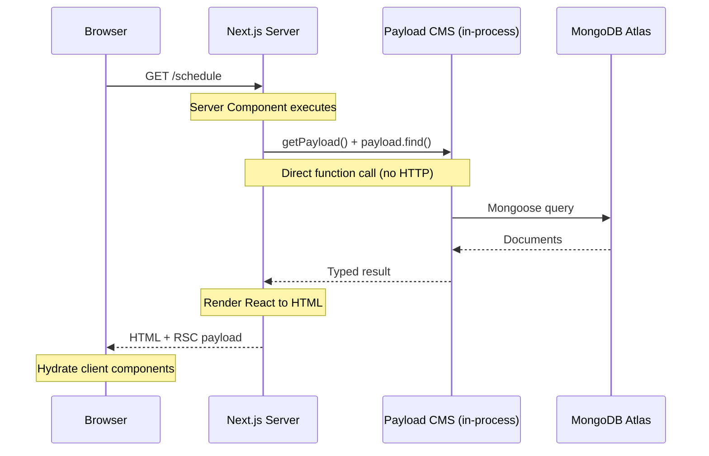
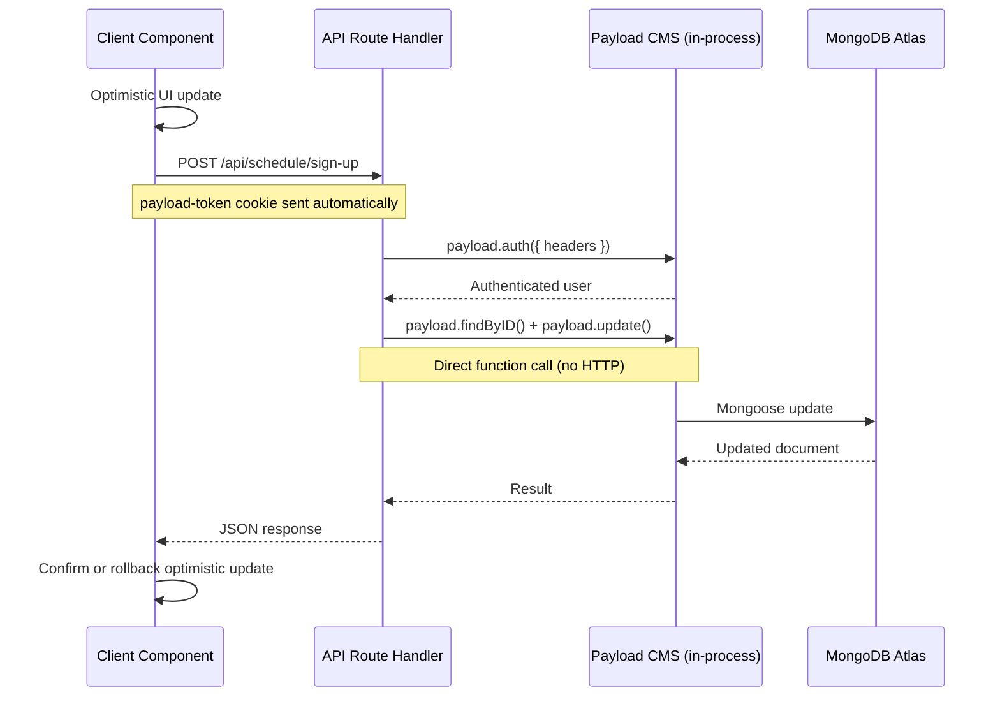
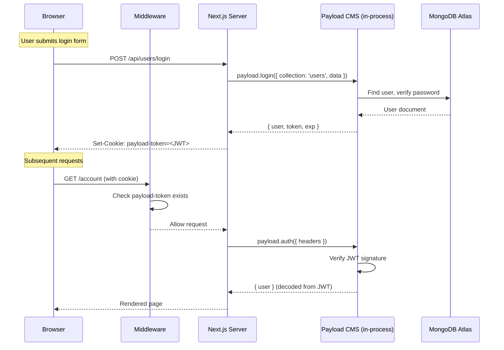
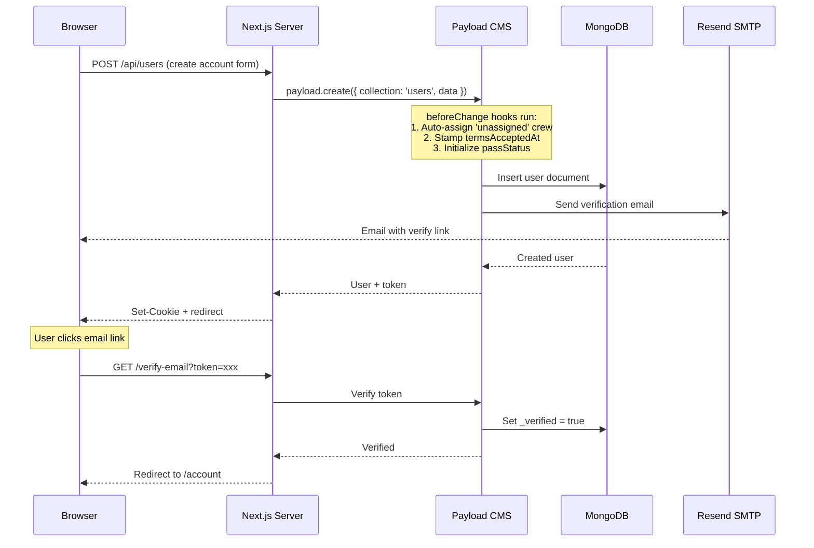
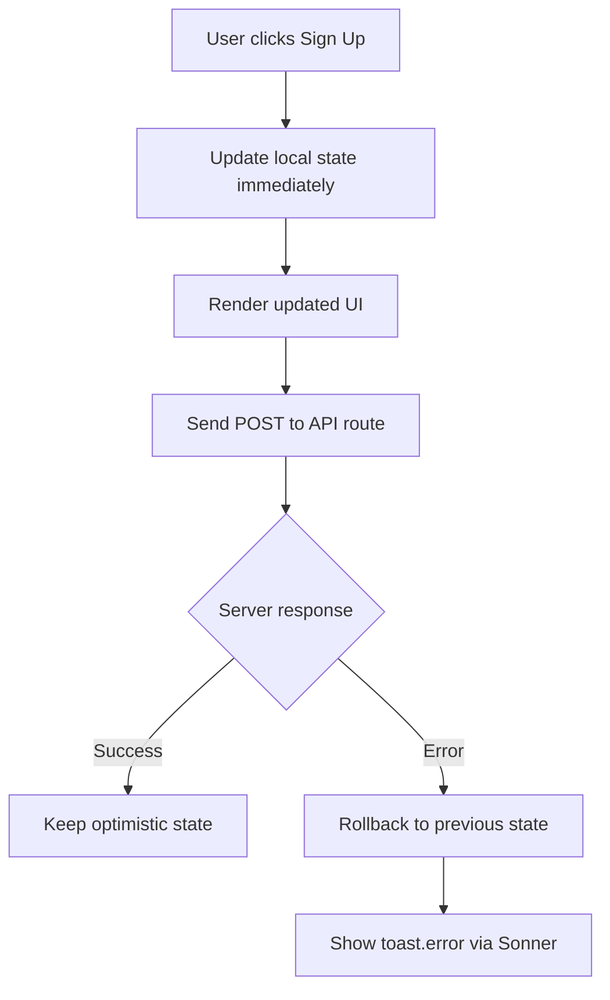

# Data Flow

This page explains how data flows through the OCFCrews application for the most common operations: page loads, client-side mutations, and authentication.

## The In-Process Advantage

The most important architectural detail to understand is that **Payload CMS runs inside the same Node.js process as Next.js**. When a server component calls `getPayload()`, it gets a direct reference to the Payload instance -- there is no HTTP request between Next.js and Payload. This eliminates network latency for all server-side data access and means the "API call" is actually a function call within the same process.

```typescript
// This is a direct in-process call, NOT an HTTP request
import { getPayload } from 'payload'
import configPromise from '@payload-config'

const payload = await getPayload({ config: configPromise })
const schedules = await payload.find({ collection: 'schedules', where: { ... } })
```

## Server Component Render

The most common data flow is a server component fetching data during SSR. No client-side fetch calls are needed for the initial page load.



**Key points:**
- The server component imports `getPayload` and calls the Local API directly.
- Payload applies access control based on the authenticated user (extracted from the `payload-token` cookie via `headers()`).
- The HTML is streamed to the browser along with the React Server Component payload for hydration.
- Client components (marked with `'use client'`) hydrate on the browser and become interactive.

## Client-Side Mutation (API Route)

When a user performs an action (e.g., signing up for a shift position), the client component sends a fetch request to a Next.js API route, which then calls Payload's Local API.



**Key points:**
- The client component performs an **optimistic UI update** before the server responds, so the UI feels instant.
- The `payload-token` cookie is sent automatically with the fetch request (same-origin).
- The API route authenticates the user via `payload.auth({ headers: await getHeaders() })`.
- On success, the optimistic state is confirmed. On failure, the UI reverts to the previous state and displays a toast error via `sonner`.

### Example: Schedule Sign-Up API Route

The `/api/schedule/sign-up` route demonstrates the complete mutation pattern:

```typescript
// src/app/(app)/api/schedule/sign-up/route.ts
export async function POST(req: NextRequest): Promise<NextResponse> {
  const requestHeaders = await getHeaders()
  const payload = await getPayload({ config: configPromise })

  // 1. Authenticate the user from the cookie
  const { user } = await payload.auth({ headers: requestHeaders })
  if (!user) return NextResponse.json({ error: 'Unauthorized' }, { status: 401 })

  // 2. Validate the request body
  const { shiftId, positionIndex, action } = await req.json()

  // 3. Fetch the schedule and verify crew membership
  const schedule = await payload.findByID({
    collection: 'schedules', id: shiftId, depth: 0, overrideAccess: true
  })

  // 4. Apply business rules (past-shift guard, crew isolation, capacity)
  // 5. Update the document
  await payload.update({
    collection: 'schedules', id: shiftId,
    data: { positions: updatedPositions }, overrideAccess: true
  })

  return NextResponse.json({ success: true, action })
}
```

## Authentication Flow

Authentication uses Payload's built-in JWT cookie system. There are no third-party auth providers.



**Key points:**
- Login produces a `payload-token` JWT cookie with a **14-day expiration** (1,209,600 seconds).
- The **middleware** (`src/middleware.ts`) runs on every request to protected routes and checks only for cookie _existence_ (not validity) for fast redirection. Full JWT verification happens in the Payload layer.
- Protected route prefixes: `/account`, `/inventory`, `/recipes`, `/shop`, `/orders`, `/checkout`.
- Unauthenticated users hitting protected routes are redirected to `/login` with a warning message.
- Already-authenticated users hitting `/login` or `/create-account` are redirected to `/account`.

### Account Creation Flow



## Optimistic UI Pattern

The scheduling calendar uses an optimistic update pattern to make shift sign-ups feel instant. This pattern is used throughout the application wherever client mutations occur.



The implementation tracks optimistic overrides using a `Record<string, string[]>` keyed by `${shiftId}-${positionIndex}`. The ShiftCard component checks for optimistic overrides before rendering the canonical server data:

```typescript
// If there is an optimistic override for this position, use it;
// otherwise fall back to the actual assigned members from the server.
const members =
  optimisticOverrides[key] !== undefined
    ? optimisticOverrides[key]
    : (pos.assignedMembers ?? []).map((m) => (typeof m === 'object' ? m.id : m))
```

This approach ensures the UI responds instantly to user actions while maintaining consistency with the server state. If a request fails (e.g., position already filled, past shift), the optimistic state is rolled back and the user sees an error toast.

## Data Fetching Patterns Summary

| Scenario | Mechanism | Where Code Runs |
|----------|-----------|-----------------|
| Initial page load | Server Component + `getPayload()` | Server only |
| Protected data access | `payload.auth({ headers })` in API route | Server only |
| User mutation | `fetch('/api/...')` from client component | Client initiates, server executes |
| Real-time preview | `@payloadcms/live-preview-react` | Admin panel (client) |
| Static metadata | `generateMetadata()` server function | Build time / server |
