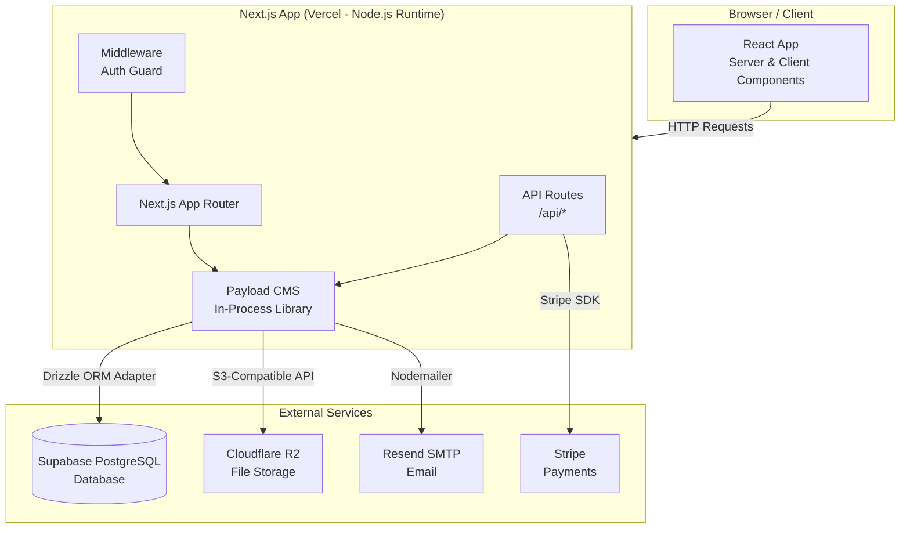

# System Overview

OCFCrews is built as a **monolithic full-stack application** where Payload CMS runs embedded inside Next.js as an in-process library, not as a separate API server. This means there is a single deployable unit that handles both the frontend (React/Next.js) and the backend (Payload CMS + PostgreSQL).

## Architecture Diagram

## Key Design Decisions

### Why a Monolith?

OCFCrews combines the CMS, API, and frontend into a single Next.js application. This architecture was chosen for several reasons:

- **Zero network latency between Next.js and Payload**: Since Payload runs in-process, server components and API routes call Payload's Local API directly via `getPayload()`. There is no HTTP overhead for internal data access -- it is a direct function call.
- **Single deployment unit**: One Vercel project, one build, one deployment. There is no need to coordinate separate API and frontend deployments.
- **Simplified development**: Developers run a single `pnpm dev` command and get the entire stack -- admin panel, frontend, API, and real-time chat -- running on one port.
- **Shared TypeScript types**: The Payload-generated `payload-types.ts` file is used by both the CMS layer and the frontend, eliminating type drift between API responses and frontend expectations.

### Why Payload CMS?

[Payload CMS](https://payloadcms.com/) was selected as the headless CMS layer for these reasons:

- **Code-first schema definition**: Collections and fields are defined entirely in TypeScript, living in the same repository as the frontend code. There is no GUI-based schema builder to fall out of sync.
- **Built-in authentication**: Payload provides JWT-based cookie authentication out of the box, including email verification, password reset, and role-based access control. No third-party auth service is needed.
- **Granular access control**: Each collection supports document-level and field-level access control functions, which are critical for the crew isolation model (coordinators can only see their own crew's data).
- **Plugin ecosystem**: Payload's plugin architecture provides turnkey integrations for e-commerce (Stripe), form building, SEO, S3 storage, and email via nodemailer.
- **Admin panel included**: Payload auto-generates a full admin panel at `/admin` based on the collection definitions, giving coordinators and admins a management interface without custom development.
- **Multi-crew support**: Users can belong to multiple crews via the `crew-memberships` collection, with one active at a time. Bidirectional hooks keep user records and memberships in sync.
- **Real-time chat (PeachChat)**: Polling-based messaging system with channels, threads, reactions, @mentions, file attachments, typing indicators, and markdown rendering. Scoped to crews with global channel support.

### Why PostgreSQL?

PostgreSQL (via Supabase) is the database backend, accessed through Payload's `@payloadcms/db-postgres` adapter (which uses Drizzle ORM internally):

- **Relational integrity**: PostgreSQL enforces referential integrity and supports complex queries with JOINs, making crew scheduling relationships (positions, assigned members, shift types) robust and queryable.
- **Payload-native**: Payload CMS has first-class PostgreSQL support with the Drizzle adapter, including automatic migration management and query optimization.
- **Supabase managed service**: Supabase provides a managed PostgreSQL instance with automated backups, connection pooling, and monitoring without operational overhead.

## Deployment Target

OCFCrews deploys to **Vercel** using the **Node.js runtime** (not Vercel Edge Functions). This is a hard requirement because:

1. **Payload CMS** requires a full Node.js runtime with access to the filesystem and native modules.
2. **Sharp** (image processing) is a native C++ addon that cannot run in edge/WASM environments.
3. **PostgreSQL driver** uses native TCP connections incompatible with the edge runtime.
4. **Nodemailer** requires Node.js `net` and `tls` modules for SMTP connections.

The Vercel deployment uses serverless functions with the Node.js runtime, and all routes are configured to avoid the edge runtime.

## External Services

| Service | Purpose | Integration |
|---------|---------|-------------|
| **Supabase PostgreSQL** | Primary database | `@payloadcms/db-postgres` (Drizzle ORM adapter) |
| **Cloudflare R2** | File/image storage (media, avatars, inventory photos) | `@payloadcms/storage-s3` (S3-compatible API) |
| **Stripe** | Payment processing for the shop/e-commerce system | `@payloadcms/plugin-ecommerce` + `stripe` SDK |
| **Resend** | Transactional email (verification, password reset, announcements) | `@payloadcms/email-nodemailer` via SMTP |
