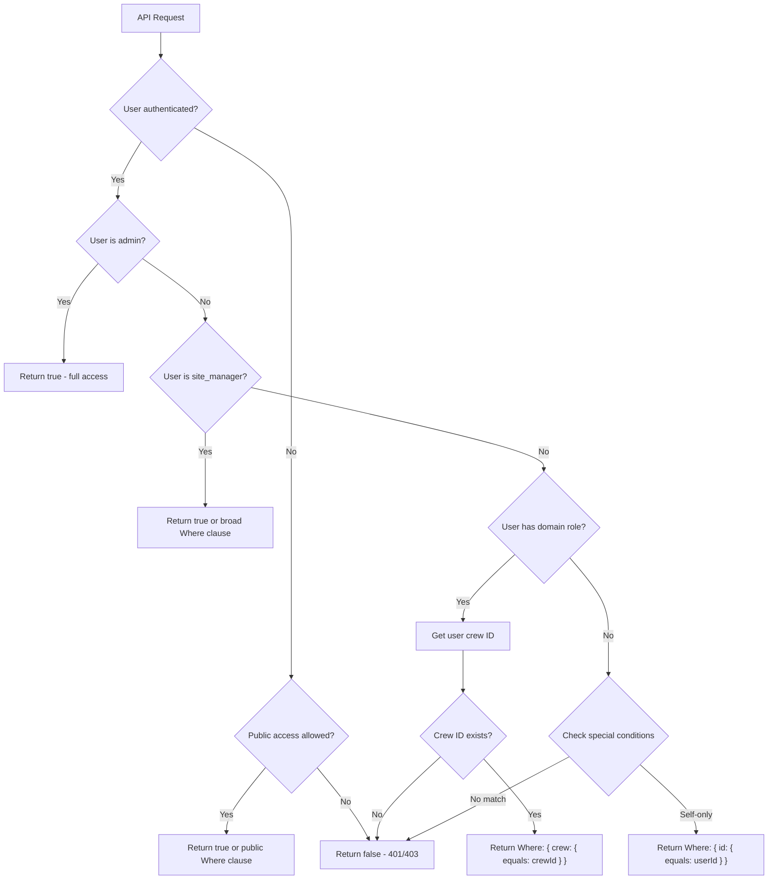

# Access Control Patterns

Payload CMS provides a powerful access control system that OCFCrews uses extensively. Every collection defines access functions for `create`, `read`, `update`, and `delete` operations. These functions can return a boolean (grant/deny) or a `Where` clause (filter results to matching documents).

## Payload's Access Control Model

### Return Types

Access control functions receive the request context and return one of three things:

| Return Value | Effect |
|---|---|
| `true` | Full access -- all documents visible/editable |
| `false` | No access -- operation denied entirely |
| `Where` clause | Filtered access -- only matching documents are visible/editable |

The `Where` clause approach is key to crew isolation. Instead of granting or denying access entirely, the access function returns a MongoDB query filter that limits results to the user's crew.

### Operation Types

| Operation | When It Runs | Typical Return |
|---|---|---|
| `create` | Before inserting a new document | Boolean (can/cannot create) |
| `read` | Before returning query results | Where clause (filter to crew) or boolean |
| `update` | Before modifying a document | Where clause (filter to crew) or boolean |
| `delete` | Before removing a document | Boolean or Where clause |

## Core Utility Functions

All access control flows through two utility functions defined in `/src/access/utilities.ts`:

### checkRole()

```typescript
export const checkRole = (allRoles: string[] = [], user?: User | null): boolean => {
  if (user && allRoles) {
    return allRoles.some((role) => {
      return user?.roles?.some((individualRole) => {
        return individualRole === role
      })
    })
  }
  return false
}
```

Returns `true` if the user has **any** of the specified roles. This is the building block for every access control decision.

### getUserCrewId()

```typescript
export const getUserCrewId = (user: User | null | undefined): string | undefined => {
  if (!user?.crew) return undefined
  const crew = user.crew
  return typeof crew === 'object' && crew !== null
    ? (crew as { id: string }).id
    : (crew as string)
}
```

Safely extracts the crew ID from the user object, handling both populated (`{ id, name, ... }`) and unpopulated (string ID) crew references.

## Access Control Decision Flow



## Common Access Patterns

### Pattern 1: Admin Only

Used for sensitive operations like deleting users or managing globals.

```typescript
// /src/access/adminOnly.ts
export const adminOnly: Access = ({ req: { user } }) => {
  if (user) return checkRole(['admin'], user)
  return false
}
```

**Used by**: User deletion, crew creation/deletion, email template management, all global updates.

### Pattern 2: Admin or Editor (Content Roles)

Used for content management operations. This function now checks `CONTENT_ROLES` (admin, editor, site_manager).

```typescript
// /src/access/adminOrEditor.ts
export const adminOrEditor: Access = ({ req: { user } }) => {
  if (!user) return false
  return checkRole(CONTENT_ROLES, user)  // ['admin', 'editor', 'site_manager']
}
```

**Used by**: Page updates/deletions, media updates/deletions, post management.

> **Note**: For operational access (schedules, emails, user management), `ADMIN_ROLES` (admin + site_manager) is used instead. Editor no longer has access to these operational features.

### Pattern 3: Crew-Scoped Read

The most common pattern for crew-isolated collections. Admins and site managers see everything; users with the required role see only their crew's data.

```typescript
// Example from Schedules collection
read: ({ req: { user } }) => {
  if (!user) return false
  if (checkRole(ADMIN_ROLES, user)) return true  // ['admin', 'site_manager']
  const crewId = getUserCrewId(user)
  if (crewId) {
    return { crew: { equals: crewId } } as Where
  }
  return false
},
```

**Used by**: Schedules, schedule-positions, inventory items, inventory categories, inventory transactions, recipes.

### Pattern 4: Inventory Role Access

Inventory collections require specific inventory roles in addition to crew membership.

```typescript
// /src/access/inventoryAccess.ts
export const inventoryCrewAccess = (crewField = 'crew'): Access => {
  return ({ req: { user } }) => {
    if (!user) return false
    if (checkRole(['admin'], user)) return true
    const crewId = getUserCrewId(user)
    if (crewId && checkRole([...INVENTORY_ROLES], user)) {
      return { [crewField]: { equals: crewId } }
    }
    return false
  }
}
```

This is a higher-order function that returns an access function. The `crewField` parameter allows it to work with any collection that has a crew reference (even if the field name differs).

### Pattern 5: Self-Only Access

Used when users should only see their own data.

```typescript
// Example from Users collection (fallback for regular members)
return { id: { equals: user.id } } as Where
```

**Used by**: Users collection (default for non-coordinator members), time-entries (for regular members), recipe-favorites.

### Pattern 6: Published Status

Used for public content that has draft/publish workflow.

```typescript
// /src/access/adminOrPublishedStatus.ts
export const adminOrPublishedStatus: Access = ({ req: { user } }) => {
  if (user && checkRole([...ADMIN_PANEL_ROLES], user)) {
    return true  // admin, editor, site_manager, viewer
  }
  return {
    _status: { equals: 'published' },
  }
}
```

**Used by**: Pages collection (drafts visible to admin/editor/site_manager/viewer, published pages visible to everyone).

### Pattern 7: Visibility-Based Access

Used by the posts collection with its three visibility levels.

```typescript
// From Posts collection
read: ({ req: { user } }) => {
  if (!user) {
    return { visibility: { equals: 'public' } } as Where
  }
  if (checkRole(CONTENT_ROLES, user)) return true  // ['admin', 'editor', 'site_manager']
  const crewId = getUserCrewId(user)
  const orConditions: Where[] = [{ visibility: { equals: 'public' } }]
  if (user.crewRole !== 'other') {
    orConditions.push({ visibility: { equals: 'all_crews' } })
  }
  if (crewId) {
    orConditions.push({
      and: [
        { visibility: { equals: 'crew' } },
        { crew: { equals: crewId } },
      ],
    })
  }
  return { or: orConditions } as Where
},
```

This combines multiple conditions: public posts are always visible, "all crews" posts are visible to any crew member, and "crew" posts are only visible to members of the specified crew.

## Example: Full Collection Access Control

Here is the complete access control configuration for the `schedules` collection, demonstrating the typical pattern:

```typescript
access: {
  // Admins, site managers, coordinators, and leaders can create schedules
  create: ({ req: { user } }) => {
    if (!user) return false
    return checkRole(SCHEDULING_ADMIN_ROLES, user)
    // ['admin', 'site_manager', 'crew_coordinator', 'crew_leader']
  },
  // Crew-scoped read: admins/site_managers see all, others see own crew
  read: ({ req: { user } }) => {
    if (!user) return false
    if (checkRole(ADMIN_ROLES, user)) return true  // ['admin', 'site_manager']
    const crewId = getUserCrewId(user)
    if (crewId) {
      return { crew: { equals: crewId } } as Where
    }
    return false
  },
  // Crew-scoped update: admins/site_managers see all, coordinators/leaders update own crew
  update: ({ req: { user } }) => {
    if (!user) return false
    if (checkRole(ADMIN_ROLES, user)) return true  // ['admin', 'site_manager']
    if (checkRole(['crew_coordinator', 'crew_leader'], user)) {
      const crewId = getUserCrewId(user)
      if (crewId) {
        return { crew: { equals: crewId } } as Where
      }
    }
    return false
  },
  // Only admins/site_managers can delete schedules
  delete: ({ req: { user } }) => {
    if (!user) return false
    return checkRole(ADMIN_ROLES, user)  // ['admin', 'site_manager']
  },
},
```

Note the pattern: operations get progressively more restrictive from `read` (broadest) to `delete` (most restricted).

## Reusable Access Functions

The codebase provides several reusable access function factories:

| Function | File | Description |
|---|---|---|
| `adminOnly` | `/src/access/adminOnly.ts` | Admin role required |
| `adminOrEditor` | `/src/access/adminOrEditor.ts` | Content roles (admin, editor, site_manager) |
| `adminOrPublishedStatus` | `/src/access/adminOrPublishedStatus.ts` | Admin panel roles see all; public sees published |
| `inventoryCrewAccess(field)` | `/src/access/inventoryAccess.ts` | Inventory roles + crew scope |
| `inventoryAdminAccess` | `/src/access/inventoryAccess.ts` | Admin or inventory_admin + crew scope |
| `recipeReadAccess` | `/src/access/recipeAccess.ts` | Any crew member can read own crew |
| `recipeEditorAccess` | `/src/access/recipeAccess.ts` | inventory_admin/editor + crew scope |
| `recipeAdminAccess` | `/src/access/recipeAccess.ts` | Admin or inventory_admin + crew scope |
| `adminOrCrewCoordinatorAccess(field)` | `/src/access/adminOrCrewCoordinator.ts` | Admin or coordinator for own crew |
