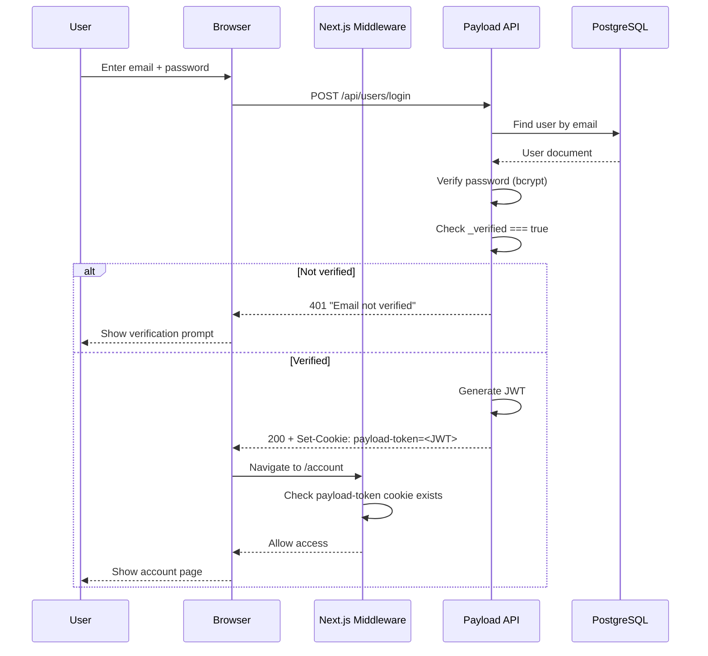
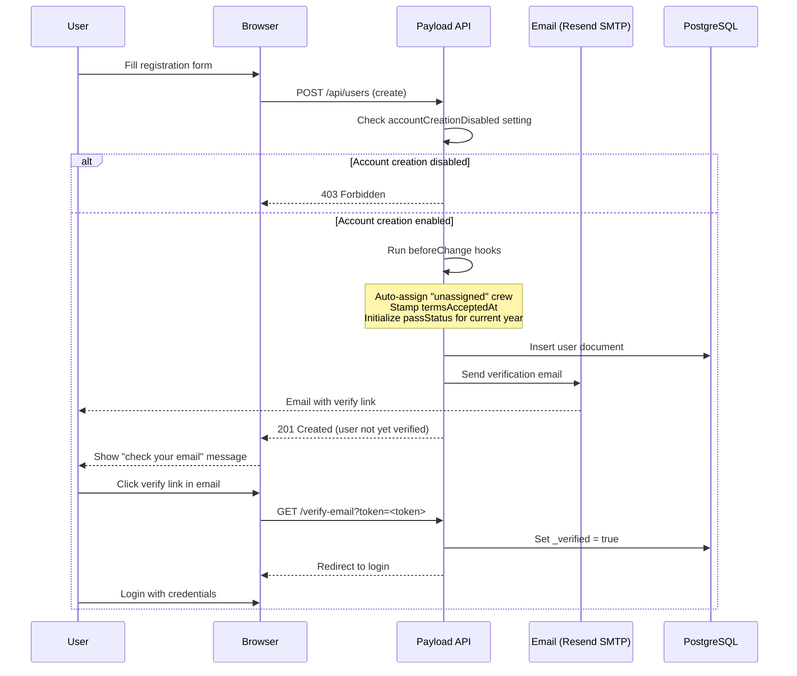

# Authentication Flow

OCFCrews uses Payload CMS's built-in cookie-based authentication. The `users` collection is the auth-enabled collection, configured with JWT tokens, email verification, and password reset.

## Configuration

The auth configuration is defined on the `users` collection:

```typescript
auth: {
  tokenExpiration: 1209600, // 14 days in seconds
  verify: {
    generateEmailSubject: () => 'Verify your OCF Crews email address',
    generateEmailHTML: async (args) => { /* renders VerifyEmailEmail component */ },
  },
  forgotPassword: {
    generateEmailSubject: () => 'Reset your OCF Crews password',
    generateEmailHTML: async (args) => { /* renders ForgotPasswordEmail component */ },
  },
},
```

Key settings:

- **Cookie name**: `payload-token`
- **JWT expiration**: 1,209,600 seconds (14 days)
- **Email verification**: Required before first login
- **Password reset**: Via email with tokenized reset link

## Login Flow



### Login Details

1. The user submits their email and password to `POST /api/users/login`.
2. Payload looks up the user by email and verifies the password using bcrypt.
3. Payload checks that `_verified` is truthy. Users who registered before email verification was enabled have `_verified` as `undefined`/`null`. An `afterRead` hook auto-patches these legacy users to `_verified: true` both in memory (for immediate JWT validation) and via a background database update.
4. On success, Payload generates a JWT and sets it as an HTTP-only cookie named `payload-token` with a 14-day expiration.
5. Subsequent requests include the cookie automatically. The Next.js middleware checks for cookie presence on protected routes (see [Route Protection Middleware](/docs/auth/middleware)).

## Registration + Email Verification Flow



### Registration Details

1. The user submits the registration form. If the `accountCreationDisabled` setting is enabled in `Global Settings`, registration is blocked.
2. Several `beforeChange` hooks run on the new user document:
   - **Auto-assign crew**: If no crew is set, the user is assigned to the "unassigned" crew (looked up by `slug: 'unassigned'`).
   - **Stamp termsAcceptedAt**: For public self-registration (no `req.user`), the current timestamp is recorded.
   - **Initialize passStatus**: A default pass status entry is created for the current year.
3. Payload sends a verification email using the `VerifyEmailEmail` React Email component, rendered server-side. The email contains a tokenized link to `/verify-email?token=<token>`.
4. The user clicks the link, Payload sets `_verified: true`, and the user can now log in.

## Password Reset Flow

1. The user navigates to `/forgot-password` and enters their email.
2. `POST /api/users/forgot-password` triggers Payload to generate a reset token and send an email.
3. The email is rendered using the `ForgotPasswordEmail` component. If a `forgot_password` email template exists in the `email-templates` collection, its headline and body are used; otherwise, built-in fallback text is used.
4. The user clicks the reset link (`/reset-password?token=<token>`) and sets a new password.
5. `POST /api/users/reset-password` verifies the token and updates the password.

## Email Configuration

Emails are sent via Resend's SMTP service:

- **Host**: `smtp.resend.com`
- **Port**: 465 (TLS)
- **Default from**: `noreply@ocfcrews.org` (configurable via `EMAIL_FROM` env var)
- **Default from name**: `OCF Crews` (configurable via `EMAIL_FROM_NAME` env var)

If the `RESEND_API_KEY` environment variable is not set, email sending is disabled entirely (the `email` config is omitted from the Payload build config).

## Token Lifecycle

| Event | Token Behavior |
|-------|---------------|
| Login | New JWT issued, set as `payload-token` cookie (14-day expiry) |
| Page navigation | Cookie sent automatically with every request |
| Middleware check | Cookie **presence** checked (not validated against DB) |
| API request | Payload validates JWT signature and expiration |
| Logout | Cookie cleared via `POST /api/users/logout` |
| Token expiry | Cookie becomes invalid after 14 days; user must re-login |

## Legacy User Auto-Verification

Users created before email verification was enabled may have `_verified` set to `undefined` or `null`. The `afterRead` hook on the `users` collection handles this:

1. On every read, if `doc._verified == null`, the hook patches the in-memory document to `{ _verified: true }`.
2. A background database update is scheduled via `setImmediate()` to persist the fix.
3. This approach avoids write conflicts during login transactions while ensuring JWT validation always succeeds.
