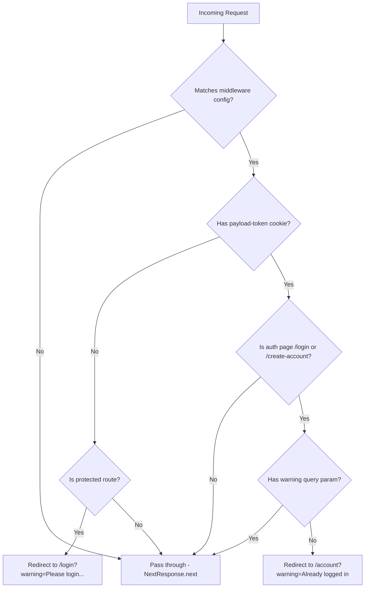

# Route Protection Middleware

OCFCrews uses Next.js middleware to protect authenticated routes and redirect users appropriately. The middleware runs at the edge on every matching request **before** the page is rendered.

## Source Code

The middleware is defined in `/src/middleware.ts`:

```typescript
import { NextResponse } from 'next/server'
import type { NextRequest } from 'next/server'

// Routes that require authentication (cookie check only, no DB call)
const PROTECTED_PREFIXES = [
  '/account',
  '/chat',
  '/crew',
  '/inventory',
  '/issues',
  '/recipes',
  '/schedule',
  '/shop',
  '/orders',
  '/checkout',
]

// Routes that should redirect to /account if already logged in
const AUTH_PAGES = ['/login', '/create-account']

export function middleware(request: NextRequest) {
  const { pathname } = request.nextUrl
  const hasToken = request.cookies.has('payload-token')

  // Redirect unauthenticated users away from protected routes
  if (!hasToken) {
    const isProtected = PROTECTED_PREFIXES.some((prefix) => pathname.startsWith(prefix))
    if (isProtected) {
      const loginUrl = new URL('/login', request.url)
      loginUrl.searchParams.set('warning', 'Please login to access this page.')
      return NextResponse.redirect(loginUrl)
    }
  }

  // Redirect authenticated users away from login/create-account
  // Skip if URL has a 'warning' param — means a layout redirected here (e.g. expired token)
  if (hasToken) {
    const isAuthPage = AUTH_PAGES.some((page) => pathname === page)
    if (isAuthPage && !request.nextUrl.searchParams.has('warning')) {
      const accountUrl = new URL('/account', request.url)
      accountUrl.searchParams.set('warning', 'You are already logged in.')
      return NextResponse.redirect(accountUrl)
    }
  }

  return NextResponse.next()
}

export const config = {
  matcher: [
    '/account/:path*',
    '/chat/:path*',
    '/crew/:path*',
    '/inventory/:path*',
    '/issues/:path*',
    '/recipes/:path*',
    '/schedule/:path*',
    '/shop/:path*',
    '/orders/:path*',
    '/checkout/:path*',
    '/login',
    '/create-account',
  ],
}
```

## Protected Routes

The following route prefixes require a `payload-token` cookie to be present:

| Route Pattern | Purpose |
|---------------|---------|
| `/account/*` | User account pages (profile, settings, pass status) |
| `/chat/*` | PeachChat messaging channels |
| `/crew/*` | Crew hub, events, and crew-specific pages |
| `/inventory/*` | Inventory management (items, categories, transactions) |
| `/issues/*` | Issue reporting and tracking |
| `/recipes/*` | Recipe browsing and management |
| `/schedule/*` | Crew schedule viewing and shift sign-ups |
| `/shop/*` | Shop product browsing |
| `/orders/*` | Order history and details |
| `/checkout/*` | Shopping cart checkout flow |

### Auth Pages (Redirect-Away)

Users who **already have** a `payload-token` cookie are redirected away from these pages:

| Route | Redirect Target |
|-------|----------------|
| `/login` | `/account?warning=You are already logged in.` |
| `/create-account` | `/account?warning=You are already logged in.` |

## Decision Flowchart



## The Warning Parameter

The `warning` query parameter serves two purposes:

1. **User feedback**: The target page reads the `warning` param and displays it as a toast message (e.g., "Please login to access this page.").

2. **Redirect loop prevention**: When an authenticated user visits `/login`, the middleware redirects them to `/account`. However, if a server-side layout component detects an expired or invalid token and redirects the user to `/login?warning=...`, the middleware must **not** redirect them away from the login page. The presence of the `warning` parameter signals that a layout-level redirect occurred (e.g., because the JWT expired or was invalidated), so the middleware allows the request through.

## Important Limitations

### Cookie Presence Only

The middleware only checks whether the `payload-token` cookie **exists** -- it does not validate the JWT signature, check expiration, or make any database calls. This is by design:

- **Performance**: Middleware runs on every matched request at the edge. JWT validation and DB lookups would add significant latency.
- **Security**: Full authentication is handled by Payload's API layer. If a user has an expired or invalid token, the API will reject their requests, and the frontend layout will redirect them to login.

### No Role Checking

The middleware does not check user roles. A user with only the `other` (unassigned) role can access `/inventory/*` at the middleware level, but the actual page components and API calls enforce role-based access control. This separation keeps the middleware fast and simple while delegating authorization to the application layer.

## Route Matching

The `config.matcher` array uses Next.js path matching syntax:

- `/account/:path*` matches `/account`, `/account/settings`, `/account/passes`, etc.
- `/login` matches only the exact `/login` path (not `/login/something`)

Only requests matching these patterns trigger the middleware function. All other routes (homepage, public pages, API routes, static assets) pass through without any middleware execution.
