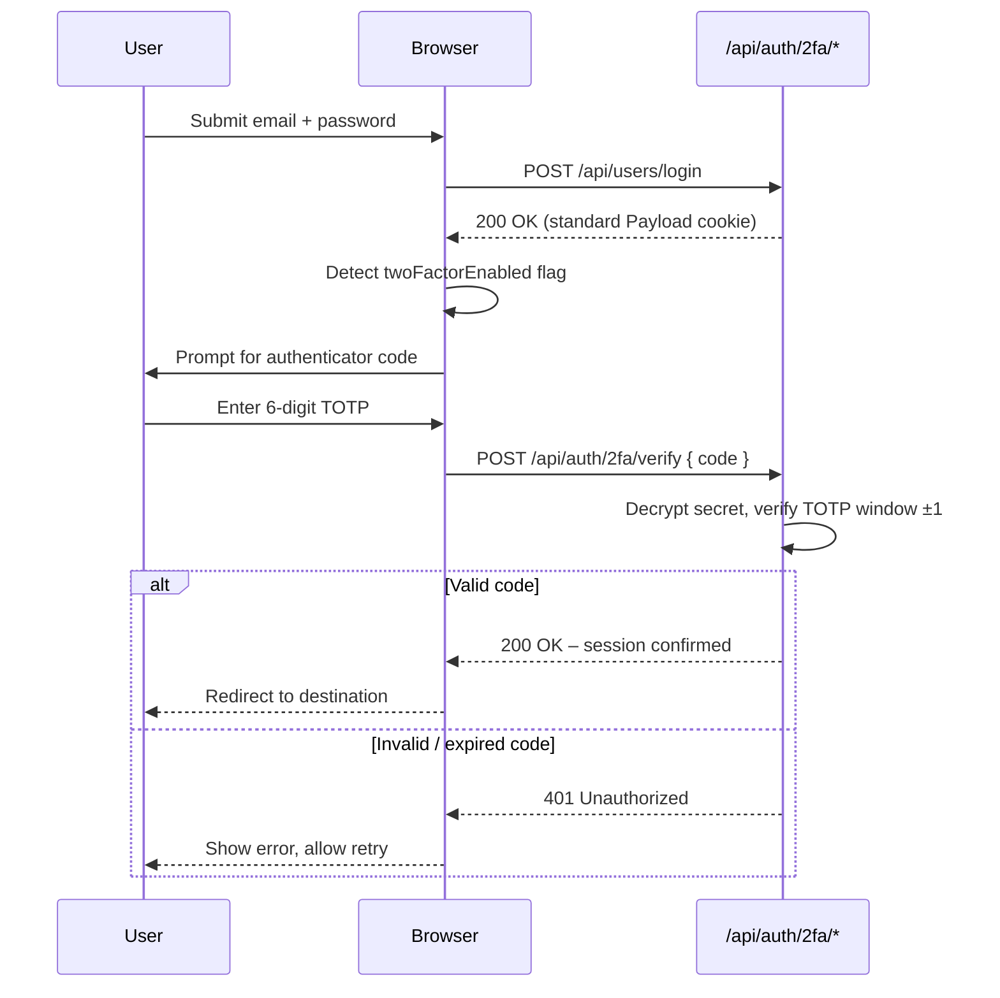
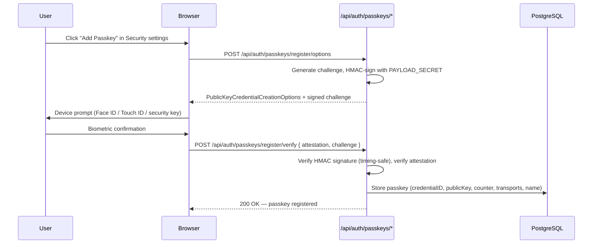
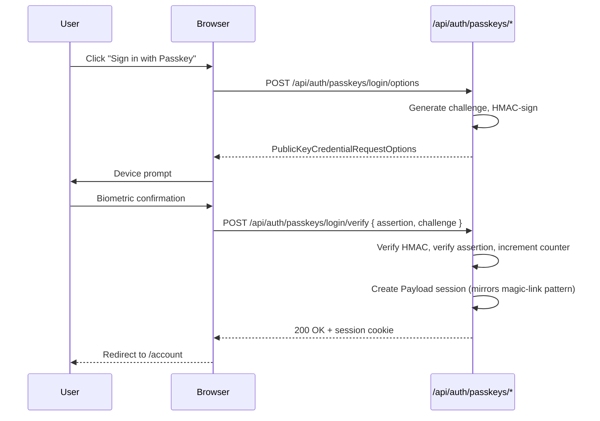
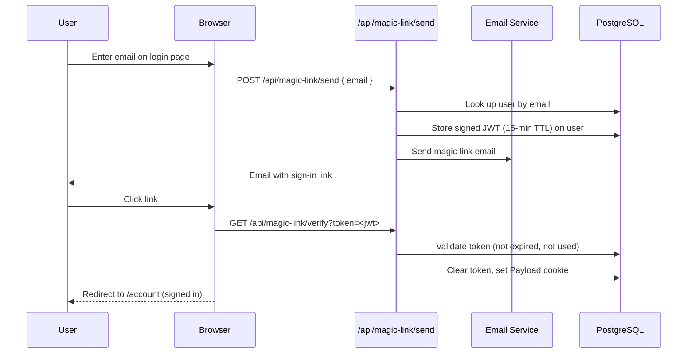

# Two-Factor Authentication, Passkeys & Magic Link

OCFCrews supports three additional sign-in security features beyond username/password: **TOTP-based two-factor authentication (2FA)**, **passkey/WebAuthn sign-in**, and **passwordless magic link sign-in**.

## Two-Factor Authentication (2FA)

2FA adds a second verification step at login using a time-based one-time password (TOTP) app such as Google Authenticator or Authy.

### Setup Flow

1. User navigates to `/account/security` and clicks **Enable**.
2. Server generates a random TOTP secret, encrypts it with AES-256-GCM (key derived from `PAYLOAD_SECRET`), stores the ciphertext on the user record, and returns a QR code URI.
3. User scans the QR code (or enters the key manually) in their authenticator app.
4. User enters the 6-digit TOTP code from the app to confirm setup.
5. Server verifies the code, saves hashed backup codes, and marks 2FA as active on the user record.

### Login with 2FA Enabled

After the standard Payload login succeeds, the client checks the `twoFactorEnabled` flag on the returned user. If set, the UI renders a TOTP prompt before granting access to the app.

### Disabling 2FA

The user returns to `/account/security`, clicks **Disable**, and enters a valid TOTP code or one of their backup codes. The server clears `twoFactorSecret`, `twoFactorEnabled`, and `twoFactorBackupCodes` from the user record.

### Backup Codes

On setup, 8 single-use backup codes are generated, hashed (SHA-256 with the user's ID as a salt), and stored. The plaintext codes are shown once to the user. Each backup code can be used in place of a TOTP code to sign in when the authenticator app is unavailable. Used codes are invalidated immediately.

### Storage

| Field | Storage |
|-------|---------|
| `twoFactorEnabled` | Boolean on user document |
| `twoFactorSecret` | AES-256-GCM encrypted base32 string (key derived from `PAYLOAD_SECRET` via HKDF) |
| `twoFactorBackupCodes` | Array of SHA-256 hashed strings (salted with userId) |

TOTP secrets are encrypted at the application level with AES-256-GCM before storage. The encryption key is derived from `PAYLOAD_SECRET` using HKDF. Legacy plaintext secrets (from before encryption was added) are handled transparently — `decryptTotpSecret()` falls back to treating the value as raw base32 if decryption fails. Backup codes are hashed (SHA-256, salted with user ID) before storage.

### Access Control

The 2FA setup/verify/disable routes (`/api/auth/2fa/*`) require an active session cookie. They are not accessible without being logged in.

---

## Passkey / WebAuthn Sign-In

Passkeys provide password-free authentication using biometrics (Face ID, Touch ID, fingerprint) or hardware security keys via the [WebAuthn](https://webauthn.io/) standard.

### Library

Uses `@simplewebauthn/server@12` (server) and `@simplewebauthn/browser@12` (client).

### Registration Flow

### Login Flow

### Collection: `passkeys`

| Field | Description |
|-------|-------------|
| `user` | Relationship → users |
| `credentialID` | Base64url-encoded credential identifier |
| `publicKey` | Base64url-encoded public key |
| `counter` | Signature counter (anti-replay) |
| `transports` | Array of transport hints (usb, ble, nfc, internal) |
| `name` | User-assigned label (e.g., "MacBook Pro") |

### Stateless Challenges

Challenges are **not stored server-side**. Instead, they are HMAC-signed (SHA-256) with `PAYLOAD_SECRET` and returned to the client. On verification, the HMAC is validated with `crypto.timingSafeEqual` — if valid, the challenge is accepted. This avoids a database round-trip and works across serverless instances.

### Security

- Credential IDs are unique per user (compound index).
- Counter verification prevents credential cloning.
- HMAC verification uses constant-time comparison to prevent timing attacks.
- Passkeys are automatically deleted when a user account is deleted (via `cleanupOnUserDelete` hook).

### Frontend

The `PasskeySettings` component (`src/app/(app)/(account)/account/security/PasskeySettings.tsx`) shows:
- List of registered passkeys with name and registration date
- **Add Passkey** button to register a new credential
- **Delete** button to remove a passkey

---

## Magic Link Sign-In

Magic link allows passwordless sign-in via a one-time link emailed to the user.

### Flow

- The magic link token is a signed JWT with a **15-minute TTL**.
- Once used, the token is cleared from the user record and cannot be reused.
- If the user has **2FA enabled**, they are still prompted for a TOTP code after clicking the magic link.

### Security Notes

- The `/api/magic-link/send` endpoint always returns `200 OK` regardless of whether the email exists, to prevent user enumeration.
- Tokens are stored server-side and validated against the stored copy — replaying an old link after it has been used or has expired is rejected.

---

## Session Management

Users can view and manage their active login sessions from `/account/security`.

### Features

- **Session list**: Shows all active sessions with device type (desktop/mobile icon) and creation timestamp
- **Current session indicator**: The active session is clearly marked and cannot be revoked
- **Revoke session**: Any non-current session can be revoked, immediately signing that device out
- Useful for: leaving a session open on a shared computer, suspected unauthorized access

### API

| Endpoint | Method | Description |
|----------|--------|-------------|
| `/api/auth/sessions` | GET | List the current user's active (non-expired) sessions |
| `/api/auth/sessions` | DELETE | Revoke a specific session by ID (requires CSRF header) |

### Implementation

- Sessions are stored as an array on the Payload user document
- The GET endpoint filters out expired sessions before returning
- The DELETE endpoint removes the specified session from the array
- Rate limited and CSRF-protected
- The `SessionManager` client component (`src/app/(app)/(account)/account/security/SessionManager.tsx`) handles the UI with optimistic updates and error toasting
