# Entity Relationship Diagram

This diagram shows all collections in the OCFCrews data model and their relationships. Key fields are listed for each entity; full field definitions live in the collection source files.

```mermaid
erDiagram
    USERS {
        string id PK
        string email
        string name
        string nickname
        string phone
        string crewRole
        string[] roles
        string crewPassEligibility
        array passStatus
        array hoursPerYear
    }

    CREWS {
        string id PK
        string name
        string slug UK
        string description
        string campLocation
    }

    SCHEDULES {
        string id PK
        date date
        string shiftType
        string meal
        string note
        array positions
    }

    SCHEDULE_POSITIONS {
        string id PK
        string name
    }

    TIME_ENTRIES {
        string id PK
        string date
        number hours
    }

    INVENTORY_ITEMS {
        string id PK
        string packageName
        string nickname
        string sku
        string brand
        string storageType
        string unit
        number initialAmount
        number currentAmount
        number itemCost
        number totalCost
    }

    INVENTORY_CATEGORIES {
        string id PK
        string name
        string icon
    }

    INVENTORY_SUBCATEGORIES {
        string id PK
        string name
    }

    INVENTORY_TRANSACTIONS {
        string id PK
        string type
        number quantity
        number quantityBefore
        number quantityAfter
        string notes
    }

    INVENTORY_MEDIA {
        string id PK
        string alt
        string filename
    }

    RECIPES {
        string id PK
        string name
        string group
        string status
        boolean imageOnly
        number servings
        number prepTime
        number cookTime
        array ingredients
        array steps
    }

    RECIPE_FAVORITES {
        string id PK
    }

    RECIPE_SUBGROUPS {
        string id PK
        string name
        string group
    }

    RECIPE_TAGS {
        string id PK
        string name
    }

    PAGES {
        string id PK
        string title
        string slug UK
        string _status
    }

    POSTS {
        string id PK
        string title
        string slug UK
        string visibility
        date publishedAt
    }

    CATEGORIES {
        string id PK
        string title
        string slug UK
    }

    MEDIA {
        string id PK
        string alt
        string filename
    }

    AVATARS {
        string id PK
        string filename
    }

    EMAIL_TEMPLATES {
        string id PK
        string key UK
        string label
        string defaultSubject
    }

    EMAILS {
        string id PK
        string subject
        string status
        string recipientType
        date sentAt
    }

    PRODUCTS {
        string id PK
        string title
        string slug UK
        string _status
    }

    ORDERS {
        string id PK
        number total
        string currency
    }

    CARTS {
        string id PK
    }

    ADDRESSES {
        string id PK
    }

    CREW_MEMBERSHIPS {
        string id PK
        string crewRole
        boolean active
        string crewPassEligibility
    }

    CHAT_CHANNELS {
        string id PK
        string name
        string type
        string description
        boolean archived
    }

    CHAT_MESSAGES {
        string id PK
        string content
        json reactions
        number threadReplyCount
        boolean pinned
        boolean edited
        boolean deleted
    }

    CHAT_MEDIA {
        string id PK
        string filename
    }

    CHAT_READ_STATE {
        string id PK
        date lastReadAt
        boolean muted
    }

    %% Account relationships
    USERS }o--|| CREWS : "belongs to (crew)"
    USERS ||--o| AVATARS : "has profile photo"
    CREWS ||--o{ USERS : "has members (join)"
    CREWS }o--o{ USERS : "has coordinators"
    CREWS ||--o| MEDIA : "has crew image"
    CREW_MEMBERSHIPS }o--|| USERS : "member (user)"
    CREW_MEMBERSHIPS }o--|| CREWS : "belongs to (crew)"

    %% Scheduling relationships
    SCHEDULES }o--|| CREWS : "belongs to (crew)"
    SCHEDULES }o--o{ USERS : "has leads"
    SCHEDULES }o--o{ SCHEDULE_POSITIONS : "has positions (array)"
    SCHEDULES }o--o{ USERS : "has assignedMembers (array)"
    SCHEDULE_POSITIONS }o--|| CREWS : "belongs to (crew)"
    TIME_ENTRIES }o--|| USERS : "logged by (user)"
    TIME_ENTRIES }o--o| SCHEDULES : "linked to (schedule)"
    TIME_ENTRIES }o--|| CREWS : "belongs to (crew)"

    %% Inventory relationships
    INVENTORY_ITEMS }o--|| CREWS : "belongs to (crew)"
    INVENTORY_ITEMS }o--o| INVENTORY_CATEGORIES : "categorized by"
    INVENTORY_ITEMS }o--o| INVENTORY_SUBCATEGORIES : "sub-categorized by"
    INVENTORY_ITEMS ||--o| INVENTORY_MEDIA : "has image"
    INVENTORY_CATEGORIES }o--|| CREWS : "belongs to (crew)"
    INVENTORY_CATEGORIES ||--o{ INVENTORY_SUBCATEGORIES : "has subcategories (join)"
    INVENTORY_SUBCATEGORIES }o--|| CREWS : "belongs to (crew)"
    INVENTORY_SUBCATEGORIES }o--|| INVENTORY_CATEGORIES : "child of (category)"
    INVENTORY_TRANSACTIONS }o--|| INVENTORY_ITEMS : "affects (item)"
    INVENTORY_TRANSACTIONS }o--|| CREWS : "belongs to (crew)"
    INVENTORY_TRANSACTIONS }o--o| USERS : "logged by (user)"
    INVENTORY_MEDIA }o--o| CREWS : "belongs to (crew)"

    %% Recipe relationships
    RECIPES }o--|| CREWS : "belongs to (crew)"
    RECIPES }o--o| RECIPE_SUBGROUPS : "in sub-group"
    RECIPES }o--o{ RECIPE_TAGS : "tagged with"
    RECIPES }o--o| INVENTORY_MEDIA : "has image"
    RECIPES }o--o| USERS : "created by"
    RECIPES }o--o| USERS : "updated by"
    RECIPE_FAVORITES }o--|| USERS : "favorited by (user)"
    RECIPE_FAVORITES }o--|| RECIPES : "favorites (recipe)"
    RECIPE_FAVORITES }o--|| CREWS : "belongs to (crew)"
    RECIPE_SUBGROUPS }o--|| CREWS : "belongs to (crew)"
    RECIPE_TAGS }o--|| CREWS : "belongs to (crew)"

    %% Content relationships
    POSTS }o--o| CREWS : "scoped to (crew)"
    POSTS }o--o| USERS : "written by (author)"
    POSTS }o--o| MEDIA : "has hero image"
    PAGES }o--o| MEDIA : "has media"

    %% Email relationships
    EMAILS }o--o| EMAIL_TEMPLATES : "uses template"
    EMAILS }o--o| CREWS : "targets crew"

    %% Chat relationships
    CHAT_CHANNELS }o--o| CREWS : "scoped to (crew)"
    CHAT_CHANNELS }o--o| USERS : "created by"
    CHAT_MESSAGES }o--|| CHAT_CHANNELS : "posted in (channel)"
    CHAT_MESSAGES }o--|| USERS : "sent by (user)"
    CHAT_MESSAGES }o--o| CREWS : "crew context"
    CHAT_MESSAGES }o--o{ CHAT_MEDIA : "has attachments"
    CHAT_MESSAGES }o--o| CHAT_MESSAGES : "thread reply (parentMessage)"
    CHAT_MESSAGES }o--o| USERS : "pinned by"
    CHAT_MEDIA }o--o| CREWS : "belongs to (crew)"
    CHAT_READ_STATE }o--|| USERS : "reader (user)"
    CHAT_READ_STATE }o--|| CHAT_CHANNELS : "tracks (channel)"

    %% Shop relationships
    PRODUCTS }o--o| CREWS : "scoped to (crew)"
    PRODUCTS }o--o{ CATEGORIES : "in categories"
    PRODUCTS }o--o{ MEDIA : "has gallery images"
    ORDERS }o--|| USERS : "placed by (customer)"
    CARTS }o--|| USERS : "owned by (customer)"
    ADDRESSES }o--|| USERS : "belongs to (customer)"
```

## Key Relationship Patterns

### Crew as Central Entity

The `crews` collection is the central organizational unit. Nearly every domain collection has a `crew` relationship field that scopes data to a specific crew. This is the foundation of the [Crew Isolation Pattern](/docs/data-model/crew-isolation).

### Relationship Types

- **Direct relationships** (`type: 'relationship'`): Store an ID reference to another collection's document. Resolved to the full document when `depth > 0` in API queries.
- **Join fields** (`type: 'join'`): Virtual reverse-lookup fields that do not store data but display related documents in the admin panel. Examples: `crews.members` (join on `users.crew`), `inventory-categories.subCategories` (join on `inventory-subcategories.category`).
- **Array relationships**: Some collections embed relationships inside arrays (e.g. `schedules.positions[].position` links to `schedule-positions`, and `schedules.positions[].assignedMembers` links to `users`).

### Ownership and Audit Fields

Several collections track who created or modified records:

- `recipes`: `createdBy` and `updatedBy` (relationship to `users`), auto-stamped in `beforeChange` hooks
- `inventory-transactions`: `user` field auto-stamped from the authenticated user
- `posts`: `author` field auto-stamped on creation
- `time-entries`: `user` field set explicitly (required)
- `chat-messages`: `user` auto-stamped from authenticated user; `crew` auto-stamped from channel's crew
- `chat-channels`: `createdBy` auto-stamped on creation
