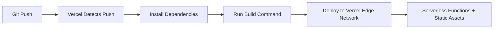

# Vercel Deployment

OCFCrews is deployed on **Vercel** using the full Node.js runtime. This is a deliberate architectural choice -- several core dependencies require a Node.js server environment and are **not compatible** with edge runtimes or Cloudflare Workers.

## Why Vercel (Not Cloudflare/Edge)

| Dependency | Requirement |
|-----------|-------------|
| **Payload CMS 3.x** | Requires full Node.js runtime for server-side rendering, API routes, and admin panel |
| **PostgreSQL (Drizzle)** | Native TCP socket connections are not available in edge runtimes |
| **Sharp** | Native image processing library compiled with C++ bindings (requires Node.js) |
| **Nodemailer** | SMTP connections require TCP sockets |

Cloudflare Workers, Deno Deploy, and other edge runtimes lack the Node.js APIs these libraries depend on (e.g., `net`, `fs`, `child_process`).

## Deployment Flow



1. **Git Push** - Push to the repository (GitHub)
2. **Vercel Detects Push** - Vercel's GitHub integration triggers a build
3. **Install Dependencies** - `pnpm install` runs automatically
4. **Run Build Command** - Executes the configured build command (see [Build Process](./build-process))
5. **Deploy** - Static assets go to the CDN; API routes and SSR pages deploy as serverless functions
6. **Live** - The deployment is available at the configured domain

## Vercel Project Settings

### Framework Preset

| Setting | Value |
|---------|-------|
| Framework | **Next.js** |
| Build Command | `pnpm build` (or use the `build` script from `package.json`) |
| Output Directory | `.next` (auto-detected) |
| Install Command | `pnpm install` |
| Node.js Version | 20.x (recommended) |

### Root Directory

The project root is the repository root (where `package.json` lives). The `docs/` directory is a separate Docusaurus site and should not be confused with the main application.

## Deployment Environments

Vercel provides three deployment tiers:

| Environment | Branch | URL Pattern | Use Case |
|-------------|--------|-------------|----------|
| **Production** | `main` | `ocfcrews.org` | Live production site |
| **Preview** | Feature branches | `<branch>-<project>.vercel.app` | PR previews and testing |
| **Development** | Local | `localhost:3000` | Local development |

### Preview Deployments

Every pull request automatically gets a preview deployment. This is useful for:
- Testing changes before merging to main
- Sharing work-in-progress with team members
- Running manual QA against a real deployment

## Vercel Functions Configuration

Payload CMS API routes and Next.js server-side rendering run as **Vercel Serverless Functions** (not Edge Functions). This is required for PostgreSQL connectivity and Sharp image processing.

### Function Regions

Configure the function region close to your Supabase PostgreSQL instance for lowest latency. For example, if your Supabase project is in `us-east-1`, set the Vercel function region to `iad1` (US East - N. Virginia).

This can be configured in `vercel.json` or the Vercel dashboard under Project Settings > Functions.

## Domain Configuration

1. In the Vercel dashboard, go to **Project Settings > Domains**
2. Add your custom domain (e.g., `ocfcrews.org`)
3. Update DNS records as instructed by Vercel
4. Vercel automatically provisions SSL certificates

Ensure the `NEXT_PUBLIC_SERVER_URL` environment variable matches your production domain:

```env
NEXT_PUBLIC_SERVER_URL=https://ocfcrews.org
```

## Monitoring

Vercel provides built-in monitoring:
- **Function Logs** - View serverless function execution logs in real-time
- **Analytics** - Web Vitals and performance metrics
- **Error Tracking** - Runtime errors are surfaced in the deployment dashboard

## Rollback

If a deployment introduces issues, you can instantly roll back to a previous deployment from the Vercel dashboard. This switches the production alias to the previous build without requiring a new build.
