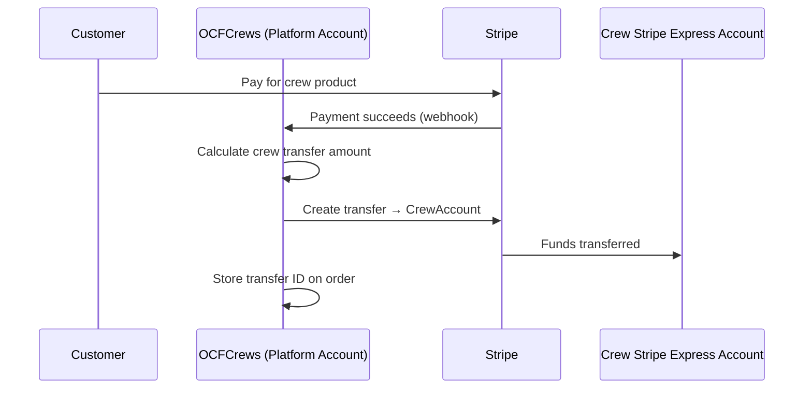

# Stripe Connect — Crew Payments

OCFCrews uses **Stripe Connect Express** to automatically transfer a crew's share of product sales to their own Stripe account after each successful payment. Coordinators manage this from `/crew/payments`.

## How It Works



1. A customer purchases a crew-specific product.
2. Stripe processes the payment and sends a `payment_intent.succeeded` webhook to the platform.
3. The platform calculates the crew's portion and creates a Stripe transfer to the crew's connected Express account.
4. The transfer ID is stored on the `order` document for audit purposes.

## Coordinator Onboarding

Coordinators connect their crew to Stripe from `/crew/payments`:

1. Click **Connect Stripe Account**.
2. Redirected to Stripe's hosted onboarding flow (Express account creation).
3. Complete identity verification and bank account setup with Stripe.
4. Stripe redirects back to the platform with an `account_id`.
5. The `stripeAccountId` is saved on the `crews` document along with `stripeOnboardingComplete: true`.

Stripe handles all identity verification and regulatory compliance — OCFCrews never sees bank or personal details beyond what Stripe provides via its API.

## Crew Fields (Stripe-related)

| Field | Description |
|-------|-------------|
| `stripeAccountId` | The connected Stripe Express account ID |
| `stripeOnboardingComplete` | Boolean — whether onboarding is finished |
| `checkoutEnabled` | Boolean — coordinator toggle to enable/disable checkout |

## Checkout Toggle

Coordinators can enable or disable checkout for their crew's products via the **Crew Payments** page. When `checkoutEnabled: false`, the platform prevents adding that crew's products to the cart.

## Crew Dashboard Link

Coordinators who have completed onboarding can access their **Stripe Express Dashboard** to view payouts, balances, and transaction history. The platform generates a temporary dashboard link via `POST /api/stripe/connect/dashboard-link`.

## Transfer Records

Each successful transfer is recorded on the order document:

```json
{
  "stripeTransfers": [
    {
      "crew": "<crew_id>",
      "transferId": "tr_xxxx",
      "amount": 4500,
      "currency": "usd"
    }
  ]
}
```

`amount` is in cents.

## Access Control

| Action | Who |
|--------|-----|
| Connect/manage Stripe account | Coordinator, Shop Admin, Admin |
| View crew payments page | Coordinator, Shop Admin, Admin |
| Toggle checkout | Coordinator, Shop Admin, Admin |
| View transfer records on orders | Coordinator (own crew), Shop Admin, Admin |

## Webhooks

See [Webhooks](./webhooks) for the full webhook event handling documentation.

## Related

- [Stripe Integration](./stripe-integration)
- [Orders](./orders)
- [Webhooks](./webhooks)
- [Crews Collection](../../collections/crews)
