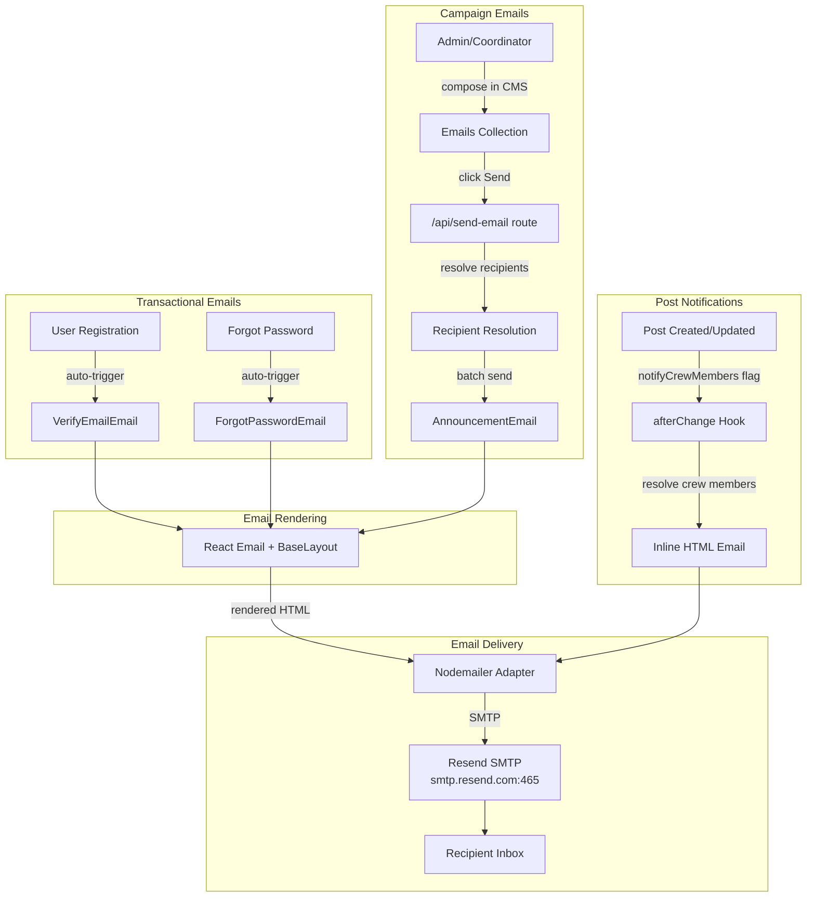

# Email System Overview

OCFCrews has a comprehensive email system that handles both transactional emails (account verification, password resets) and campaign-style emails (announcements, crew communications). All email is sent via Resend's SMTP service using the Nodemailer adapter.

## Architecture

## Email Categories

### 1. Transactional Emails

These are triggered automatically by system events:

| Email | Trigger | Template |
|-------|---------|----------|
| **Email Verification** | User creates an account | `VerifyEmailEmail` component |
| **Password Reset** | User requests password reset | `ForgotPasswordEmail` component |

Transactional emails are configured in the Users collection's `auth.verify` and `auth.forgotPassword` settings. They use React Email components rendered to HTML via `@react-email/render`.

### 2. Campaign Emails

Campaign emails are composed and sent by admins, editors, and crew coordinators through the Payload CMS admin panel:

- Campaigns are stored in the **Emails** collection
- Each campaign has a subject, headline, rich text body, optional CTA button, and recipient configuration
- Sending is triggered by clicking a "Send" button in the admin panel sidebar
- Emails are sent via the `/api/send-email` route handler

### 3. Post Notifications

When a post is published with the `notifyCrewMembers` checkbox enabled, an `afterChange` hook automatically sends email notifications to relevant crew members. These use inline HTML rather than React Email components.

## Key Components

| Component | Location | Purpose |
|-----------|----------|---------|
| `BaseLayout` | `src/emails/BaseLayout.tsx` | Shared email wrapper with header, footer, and branding |
| `AnnouncementEmail` | `src/emails/AnnouncementEmail.tsx` | Campaign email template with headline, body, and CTA |
| `ForgotPasswordEmail` | `src/emails/ForgotPasswordEmail.tsx` | Password reset email with customizable content |
| `VerifyEmailEmail` | `src/emails/VerifyEmailEmail.tsx` | Email verification with activation link |
| `emailBodyEditor` | `src/emails/emailEditor.ts` | Shared Lexical editor config for email body fields |
| `lexicalToHtml` | `src/emails/utils/lexicalToHtml.ts` | Converts Lexical rich text to email-safe HTML |

## Collections

| Collection | Purpose |
|------------|---------|
| `email-templates` | Reusable templates with default subjects, headlines, and bodies |
| `emails` | Individual email campaigns with recipients, content, and send status |

## Sending Infrastructure

Email delivery uses:

- **Nodemailer adapter** (`@payloadcms/email-nodemailer`) configured in `payload.config.ts`
- **Resend SMTP** (`smtp.resend.com:465`) as the transport
- **Conditional setup**: Email configuration is only applied if the `RESEND_API_KEY` environment variable is set

## Security Measures

- **Header injection prevention**: User-supplied strings are sanitized to remove ASCII control characters before being used in email headers
- **URL scheme allowlisting**: The `lexicalToHtml` function only permits `http:`, `https:`, `mailto:`, relative, and fragment URL schemes; all others are replaced with `#`
- **CTA URL validation**: CTA button URLs are validated to use only `http:` or `https:` protocols
