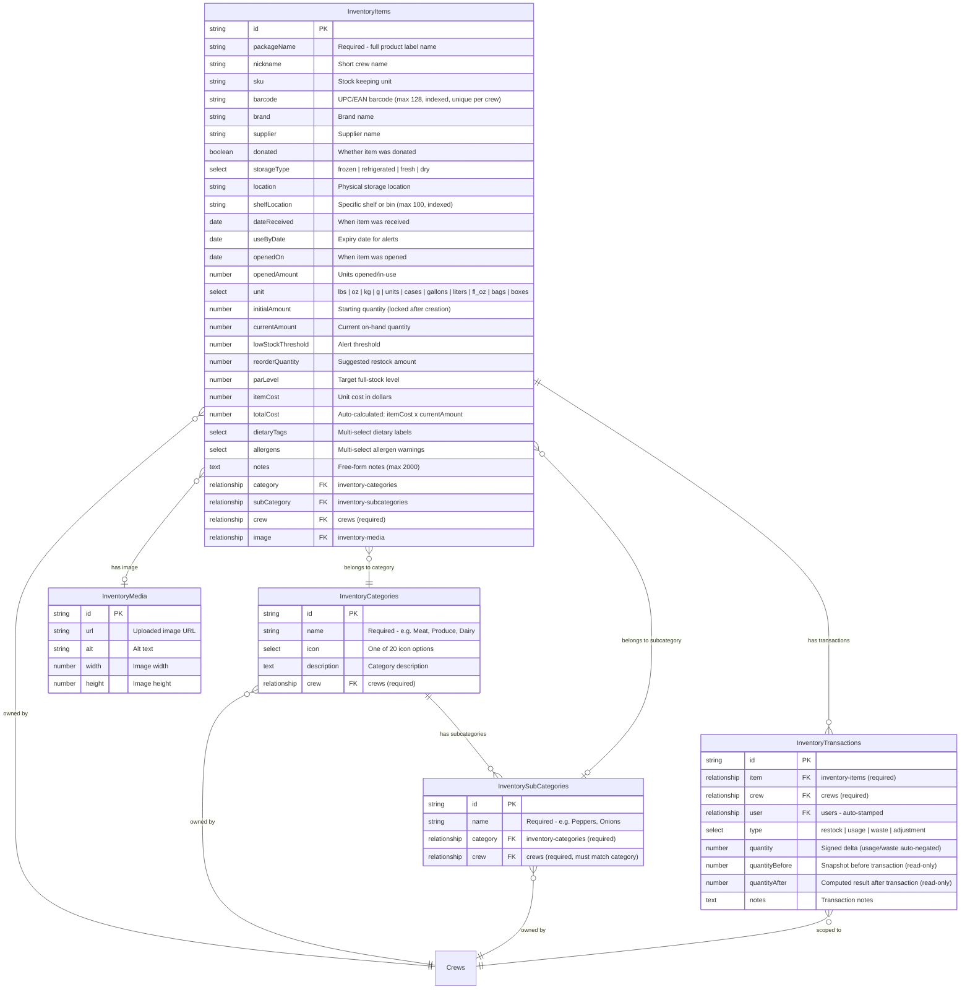

# Inventory Data Model

This page documents the entity relationships and key fields for each inventory collection.

## Entity Relationship Diagram

## InventoryItems Fields

### Identity Fields

| Field | Type | Required | Description |
|---|---|---|---|
| `packageName` | text | Yes | Full product name as it appears on the label (max 200 chars) |
| `nickname` | text | No | Short informal name used by the crew (max 200 chars) |
| `sku` | text | No | Stock keeping unit code (max 100 chars) |
| `barcode` | text | No | UPC, EAN, or other barcode value (max 128 chars, indexed). Unique per crew, enforced via `beforeChange` hook. |
| `brand` | text | No | Brand name (max 100 chars) |
| `supplier` | text | No | Supplier name (max 200 chars) |
| `donated` | checkbox | No | Whether the item was donated rather than purchased |

### Storage Fields

| Field | Type | Required | Description |
|---|---|---|---|
| `storageType` | select | Yes | One of: `frozen`, `refrigerated`, `fresh`, `dry` |
| `location` | text | No | Physical storage location description (max 200 chars) |
| `shelfLocation` | text | No | Specific shelf or bin, e.g. "Shelf 3", "Bin A2" (max 100 chars, indexed) |

### Date Fields

| Field | Type | Description |
|---|---|---|
| `dateReceived` | date | When the item was received |
| `useByDate` | date | Expiry date; indexed for dashboard expiry alerts |
| `openedOn` | date | When the item was opened |
| `openedAmount` | number | How many units have been opened/are in-use |

### Quantity Fields

| Field | Type | Required | Description |
|---|---|---|---|
| `unit` | select | Yes | Unit of measurement (lbs, oz, kg, g, units, cases, gallons, liters, fl_oz, bags, boxes) |
| `initialAmount` | number | Yes | Starting quantity when first received; locked for editors after creation |
| `currentAmount` | number | Yes | Current quantity on hand; updated automatically by transactions |
| `lowStockThreshold` | number | No | Dashboard alert shown when `currentAmount` falls at or below this value |
| `reorderQuantity` | number | No | Suggested quantity to order when restocking |
| `parLevel` | number | No | Target full-stock level for progress bar; falls back to `initialAmount` if not set |

### Cost Fields

| Field | Type | Description |
|---|---|---|
| `itemCost` | number | Unit cost in dollars |
| `totalCost` | number | Auto-calculated: `itemCost * currentAmount` (read-only) |

### Dietary and Allergen Fields

| Field | Type | Description |
|---|---|---|
| `dietaryTags` | multi-select | Vegan, Vegetarian, Gluten-Free, Dairy-Free, Nut-Free, Kosher, Halal |
| `allergens` | multi-select | Tree Nuts, Peanuts, Dairy, Gluten, Shellfish, Eggs, Soy, Fish |

### Notes

| Field | Type | Description |
|---|---|---|
| `notes` | textarea | Free-form notes (max 2000 chars) |

### Relationship Fields

| Field | Type | Required | Description |
|---|---|---|---|
| `category` | relationship | No | Link to `inventory-categories` |
| `subCategory` | relationship | No | Link to `inventory-subcategories` |
| `crew` | relationship | Yes | Owning crew; auto-stamped from authenticated user |
| `image` | upload | No | Link to `inventory-media` (displayed in sidebar) |

## InventoryCategories Fields

| Field | Type | Required | Description |
|---|---|---|---|
| `name` | text | Yes | Category name, max 100 chars |
| `icon` | select | No | One of 20 icon options (see [Categories & Subcategories](./categories-subcategories.md)) |
| `description` | textarea | No | Category description, max 500 chars |
| `crew` | relationship | Yes | Owning crew |
| `subCategories` | join | -- | Virtual join to `inventory-subcategories` via the `category` field |

## InventorySubCategories Fields

| Field | Type | Required | Description |
|---|---|---|---|
| `name` | text | Yes | Subcategory name, max 100 chars |
| `category` | relationship | Yes | Parent category (must be same crew) |
| `crew` | relationship | Yes | Owning crew (validated to match parent category) |

## InventoryTransactions Fields

| Field | Type | Required | Description |
|---|---|---|---|
| `item` | relationship | Yes | The inventory item this transaction affects |
| `crew` | relationship | Yes | Crew scope; auto-stamped from user or inferred from item |
| `user` | relationship | No | Auto-stamped from authenticated user who created the transaction |
| `type` | select | Yes | Transaction type: `restock`, `usage`, `waste`, `adjustment` |
| `quantity` | number | Yes | Signed delta applied to stock (range: -99999 to 99999) |
| `quantityBefore` | number | No | Snapshot of `currentAmount` before this transaction (read-only, auto-set) |
| `quantityAfter` | number | No | Resulting `currentAmount` after this transaction (read-only, auto-set) |
| `notes` | textarea | No | Transaction notes, max 1000 chars |

## Hooks and Computed Fields

### InventoryItems Hooks

- **`beforeValidate`**: Auto-stamps the `crew` field from the authenticated user's profile to prevent "Crew is required" validation errors.
- **`beforeChange` (crew guard)**: Non-admin users are forced to their own crew. Attempting to change the `crew` field throws an error.
- **`beforeChange` (barcode uniqueness)**: Validates that the `barcode` value is unique within the crew. Queries existing items with the same barcode and crew; throws an error if a duplicate is found (excluding the current item on update).
- **`beforeChange` (cost calculation)**: Auto-computes `totalCost = itemCost * currentAmount` on every save.

### InventoryTransactions Hooks

See the [Transactions](./transactions.md) page for detailed hook documentation.
