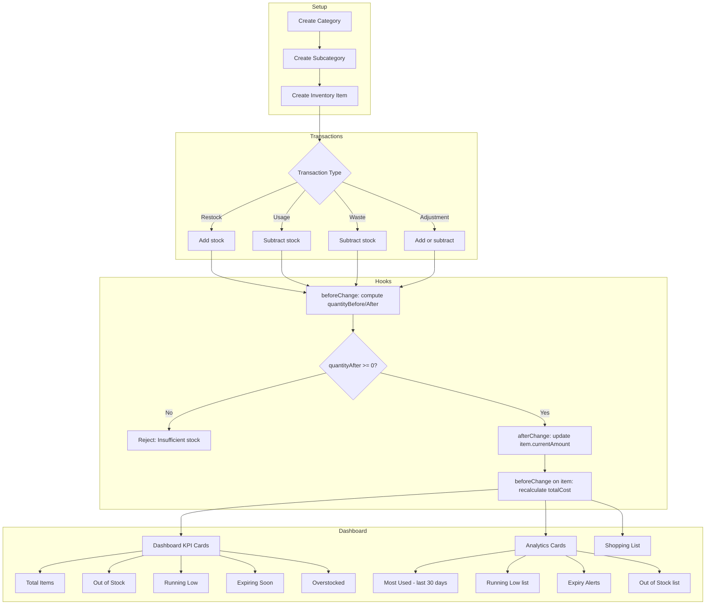

# Inventory Overview

The inventory system tracks food items and supplies for crew operations. It provides a complete picture of what your crew has on hand, what needs restocking, and what is expiring -- all scoped to individual crews so each team manages its own stock independently.

## Key Features

- **Item tracking with amounts and costs** -- Every item records its current quantity, unit cost, and auto-calculated total cost. Items include identity fields like package name, nickname, SKU, brand, and supplier.
- **Category organization** -- Items are classified under crew-specific categories (e.g., Meat, Produce, Dairy) and optional subcategories, each with a selectable icon.
- **Transaction-based quantity updates** -- All stock changes flow through an immutable transaction ledger. Transactions capture restock, usage, waste, and adjustment events with full before/after snapshots.
- **Low-stock alerts** -- Each item can define a `lowStockThreshold` and `parLevel`. The dashboard highlights items that are out of stock, running low, or below par.
- **Shopping list** -- An auto-generated view of all items that are out of stock, below their low-stock threshold, or under par level, grouped by category with suggested reorder quantities.
- **Dietary and allergen tracking** -- Items can be tagged with dietary labels (Vegan, Vegetarian, Gluten-Free, Dairy-Free, Nut-Free, Kosher, Halal) and allergen warnings (Tree Nuts, Peanuts, Dairy, Gluten, Shellfish, Eggs, Soy, Fish).
- **Image management** -- Each item can have an uploaded image (stored in the `inventory-media` collection) displayed with a lightbox viewer on the detail page.
- **Expiry tracking** -- Items with a `useByDate` are monitored on the dashboard. Expired items and those expiring within 14 days are surfaced in an Expiry Alerts card.
- **Storage type classification** -- Items are categorized by storage type: Frozen, Refrigerated, Fresh, or Dry.

## Data Flow

The following diagram shows how data moves through the inventory system, from item creation through transactions to dashboard reporting.

## Collections

The inventory system is built on five Payload CMS collections:

| Collection | Slug | Purpose |
|---|---|---|
| **InventoryItems** | `inventory-items` | Core item records with quantity, cost, and metadata |
| **InventoryCategories** | `inventory-categories` | Crew-specific category groupings with icons |
| **InventorySubCategories** | `inventory-subcategories` | Subcategories nested under categories |
| **InventoryTransactions** | `inventory-transactions` | Immutable audit log of all stock changes |
| **InventoryMedia** | `inventory-media` | Image uploads for inventory items |

## Crew Isolation

All inventory data is scoped to a crew. Every collection includes a required `crew` relationship field, and access control functions enforce that users can only see and modify data belonging to their own crew. The `beforeChange` hooks automatically stamp the crew from the authenticated user's profile, preventing cross-crew data access.

## Related Documentation

- [Data Model](./data-model.md) -- Entity relationships and field reference
- [Transactions](./transactions.md) -- How stock changes are processed
- [Categories & Subcategories](./categories-subcategories.md) -- Organizing inventory items
- [Low Stock Alerts](./low-stock-alerts.md) -- Threshold-based alerting
- [Shopping List](./shopping-list.md) -- Auto-generated reorder list
- [Frontend Pages](./frontend-pages.md) -- UI routes and components
- [Access Control](./access-control.md) -- Role-based permissions
