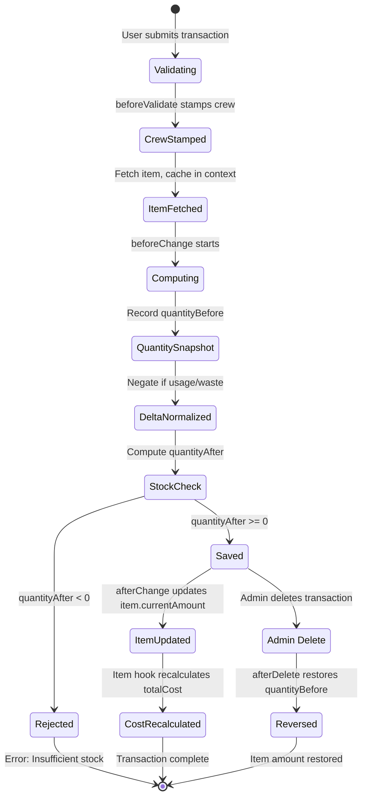

# Inventory Transactions

Transactions are the heart of the inventory system's stock tracking. Every change to an item's quantity flows through an `InventoryTransaction` record, creating an immutable audit trail of all stock movements.

## Transaction Types

| Type | Value | Behavior | Example |
|---|---|---|---|
| **Restock** | `restock` | Positive delta -- adds stock | Received 10 cases of tomatoes |
| **Usage** | `usage` | Auto-negated -- user enters positive, system subtracts | Used 3 lbs of flour for baking |
| **Waste** | `waste` | Auto-negated -- user enters positive, system subtracts | Discarded 2 lbs of spoiled chicken |
| **Adjustment** | `adjustment` | As-is -- positive adds, negative subtracts | Inventory count correction of -5 units |

## How Quantity Is Tracked

Transactions use **signed deltas** to modify stock levels. The key insight is that users always enter positive numbers for usage and waste (since it is more intuitive to type "3" than "-3"), and the system automatically negates the value in the `beforeChange` hook.

```
delta = (type === 'usage' || type === 'waste')
  ? -(Math.abs(rawQuantity))
  : rawQuantity
```

For restock and adjustment types, the quantity is taken as-is. A positive adjustment adds stock; a negative adjustment removes it.

## Hook Lifecycle

### 1. `beforeValidate` (create only)

This hook runs before Payload's required-field validation:

- **Stamps crew from user profile**: Sets `data.crew` from the authenticated user's crew if not already set.
- **Infers crew from item**: If the user has no crew (e.g., an admin), the hook fetches the linked inventory item and copies its crew. This item is cached in `req.context.__txnItem` to avoid a duplicate database query in `beforeChange`.

### 2. `beforeChange` (create only)

This hook handles the core transaction logic:

1. **Crew stamping**: Non-admin users are forced to their own crew.
2. **User stamping**: The `user` field is auto-set to the authenticated user's ID.
3. **Quantity snapshot**: Always fetches fresh item data to get the latest `currentAmount` (avoids race conditions when multiple transactions are created concurrently for the same item). Records `quantityBefore` as the item's current `currentAmount`.
4. **Delta normalization**: Converts the raw quantity to a signed delta (negating usage/waste).
5. **Stock validation**: Computes `quantityAfter = quantityBefore + delta`. If the result would be negative, the transaction is rejected with an `"Insufficient stock"` error.
6. **Records quantityAfter**: Stores the computed result on the transaction document.

### 3. `afterChange` (create only)

After the transaction is successfully saved:

1. **Guards against null**: If `quantityAfter` is null (indicating an unexpected error in `beforeChange`), the hook logs an error and skips the update rather than zeroing out the item.
2. **Updates the item**: Calls `updateItemAmount()` which sets the item's `currentAmount` to `quantityAfter` and recalculates `totalCost = itemCost * currentAmount`.

### 4. `afterDelete`

When an admin deletes a transaction (the only role allowed to do so):

- **Reversal**: Restores the item's `currentAmount` to the transaction's `quantityBefore` value, effectively undoing the transaction's effect.

## Transaction Lifecycle Diagram



## Immutability

Transactions are designed as **immutable audit records**:

- **Create**: Allowed for `admin`, `inventory_admin`, and `inventory_editor` roles.
- **Read**: Allowed for all inventory roles, scoped to the user's crew.
- **Update**: Restricted to `admin` only.
- **Delete**: Restricted to `admin` only. Deleting a transaction triggers the `afterDelete` hook to reverse its effect on the item's stock.

This design ensures a reliable audit trail. Regular users cannot modify or delete transaction history. Only system administrators can make corrections, and even then, the reversal mechanism maintains data consistency.

## The `updateItemAmount` Helper

The shared `updateItemAmount(itemId, newAmount, payload)` function is used by both `afterChange` and `afterDelete`:

```typescript
async function updateItemAmount(
  itemId: string,
  newAmount: number,
  payload: BasePayload,
): Promise<void> {
  const item = await payload.findByID({
    collection: 'inventory-items',
    id: itemId,
    depth: 0,
    overrideAccess: true,
  })
  const cost = item.itemCost ?? 0
  const safeAmount = Math.max(0, newAmount)
  await payload.update({
    collection: 'inventory-items',
    id: itemId,
    data: {
      currentAmount: safeAmount,
      totalCost: parseFloat((cost * safeAmount).toFixed(2)),
    },
    overrideAccess: true,
  })
}
```

Key behaviors:
- Uses `overrideAccess: true` to bypass access control (this is a system-level operation).
- Clamps the amount to a minimum of 0 via `Math.max(0, newAmount)`.
- Recalculates `totalCost` to keep it in sync with the new amount.
- Propagates errors so the calling hook fails visibly rather than silently desyncing.

## Quick Transaction Form

The item detail page (`/inventory/items/[id]`) includes a `QuickTransactionForm` component for non-viewer users. This form lets users log usage, waste, restock, and adjustment transactions directly from the item detail view without navigating to the Payload admin panel.
