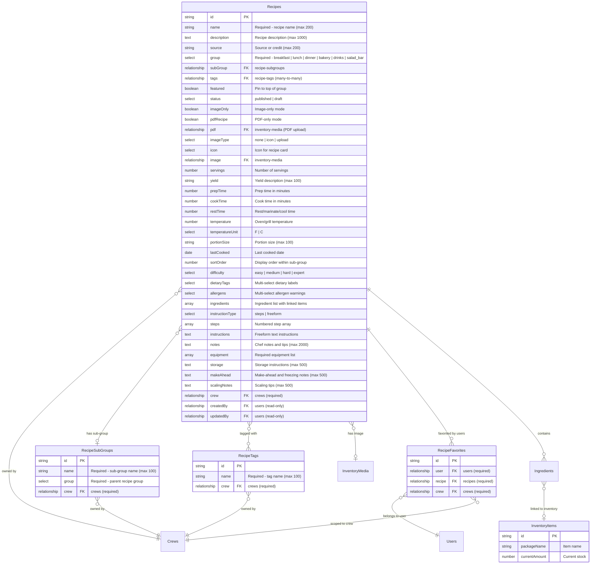

# Recipe Data Model

This page documents the entity relationships and key fields for each recipe collection.

## Entity Relationship Diagram

## Recipes Fields

### Identity Fields

| Field | Type | Required | Description |
|---|---|---|---|
| `name` | text | Yes | Recipe name (1--200 chars) |
| `description` | textarea | No | Recipe description (max 1000 chars). Hidden in image-only and PDF-only mode. |
| `source` | text | No | Source or credit, e.g., "Chef Maria", "Adapted from AllRecipes" (max 200 chars). Hidden in image-only and PDF-only mode. |

### Classification Fields

| Field | Type | Required | Description |
|---|---|---|---|
| `group` | select | Yes | Recipe group: `breakfast`, `lunch`, `dinner`, `bakery`, `drinks`, `salad_bar` |
| `subGroup` | relationship | No | Link to `recipe-subgroups`. Crew-defined subcategory within the group. |
| `tags` | relationship (hasMany) | No | Links to `recipe-tags`. Crew-defined labels for filtering. Hidden in image-only and PDF-only mode. |
| `featured` | checkbox | No | Pin this recipe to the top of its group (default: false) |
| `status` | select | No | `published` (default) or `draft`. Draft recipes are only visible to editors/admins. |
| `sortOrder` | number | No | Lower numbers display first within sub-group (default: 0) |
| `difficulty` | select | No | `easy`, `medium`, `hard`, `expert`. Hidden in image-only and PDF-only mode. |

### Visual Fields

| Field | Type | Description |
|---|---|---|
| `imageOnly` | checkbox | When enabled, shows only the image and hides all structured recipe fields |
| `pdfRecipe` | checkbox | When enabled, shows only the PDF upload and hides all structured recipe fields |
| `pdf` | upload | PDF file for this recipe, stored in `inventory-media`. Shown when `pdfRecipe` is true. |
| `imageType` | select | `none`, `icon`, or `upload`. Controls how the recipe card visual is displayed. Hidden in image-only or PDF-only mode. |
| `icon` | select | One of 17 icon options (e.g., Utensils, ChefHat, Apple, Beef, Fish, Coffee). Shown when `imageType` is `icon`. |
| `image` | upload | Photo stored in `inventory-media`. Shown when `imageOnly` is true or `imageType` is `upload` (not in PDF mode). |

### Cooking Detail Fields

| Field | Type | Description |
|---|---|---|
| `servings` | number | Number of servings (min 1). Used as base for the scaling calculator. |
| `yield` | text | Yield description, e.g., "1 full tray", "24 cookies" (max 100 chars) |
| `prepTime` | number | Prep time in minutes |
| `cookTime` | number | Cook time in minutes |
| `restTime` | number | Rest / marinate / cool time in minutes |
| `temperature` | number | Oven/grill/serving temperature |
| `temperatureUnit` | select | `F` (default) or `C` |
| `portionSize` | text | E.g., "1 cup", "1 burger" (max 100 chars) |
| `lastCooked` | date | When this recipe was last prepared |

All cooking detail fields are hidden in image-only and PDF-only mode.

### Dietary and Allergen Fields

| Field | Type | Description |
|---|---|---|
| `dietaryTags` | multi-select | Vegan, Vegetarian, Gluten-Free, Dairy-Free, Nut-Free, Kosher, Halal |
| `allergens` | multi-select | Tree Nuts, Peanuts, Dairy, Gluten, Shellfish, Eggs, Soy, Fish |

Hidden in image-only and PDF-only mode.

### Ingredients Array

Each ingredient entry has the following fields:

| Field | Type | Description |
|---|---|---|
| `inventoryItem` | relationship | Link to `inventory-items`. Leave blank for custom items. |
| `customName` | text | Custom item name (max 200 chars). Required when no inventory item is selected. |
| `quantity` | number | Amount needed (min 0) |
| `unit` | select | One of 18 units: lbs, oz, kg, g, cup, tbsp, tsp, pinch, clove, bunch, units, fl_oz, gallons, liters, cases, bags, boxes, to_taste, as_needed |
| `preparation` | text | Preparation note, e.g., "finely chopped", "room temperature" (max 200 chars) |
| `optional` | checkbox | Whether this ingredient is optional (default: false) |

Maximum 200 ingredients per recipe. Hidden in image-only and PDF-only mode.

### Instruction Fields

| Field | Type | Description |
|---|---|---|
| `instructionType` | select | `steps` (default) for numbered steps or `freeform` for plain text |
| `steps` | array | Array of step objects, each with a `step` textarea (max 5000 chars, max 200 steps) |
| `instructions` | textarea | Freeform text instructions (max 10000 chars). Shown when `instructionType` is `freeform`. |

Hidden in image-only and PDF-only mode.

### Notes and Extras

| Field | Type | Description |
|---|---|---|
| `notes` | textarea | Chef's notes, tips, substitutions, serving suggestions (max 2000 chars) |
| `equipment` | array | Required equipment list (max 50 items, each max 200 chars) |
| `storage` | textarea | Leftovers storage instructions, shelf life (max 500 chars) |
| `makeAhead` | textarea | Make-ahead and freezing notes (max 500 chars) |
| `scalingNotes` | textarea | Tips for scaling up/down for large groups (max 500 chars) |

All hidden in image-only and PDF-only mode.

### Ownership Fields

| Field | Type | Description |
|---|---|---|
| `crew` | relationship | Required. The crew this recipe belongs to. Auto-stamped from user. |
| `createdBy` | relationship | Read-only. Auto-set to the user who created the recipe. |
| `updatedBy` | relationship | Read-only. Auto-set to the user who last updated the recipe. |

## Hooks

### `beforeValidate`
Auto-stamps `crew` from the authenticated user's profile to prevent validation errors.

### `beforeChange`
1. **Crew guard**: Non-admin users are force-stamped to their own crew. Throws an error if a non-admin attempts to change the crew.
2. **Audit stamps**: Sets `createdBy` on create and `updatedBy` on every save.
3. **Instruction validation**: Validates that step-mode recipes have at least one non-empty step, and freeform-mode recipes have non-empty instructions text. Skipped for image-only and PDF-only recipes.
4. **Ingredient validation**: Ensures every ingredient has either an inventory item selected or a custom name entered.
