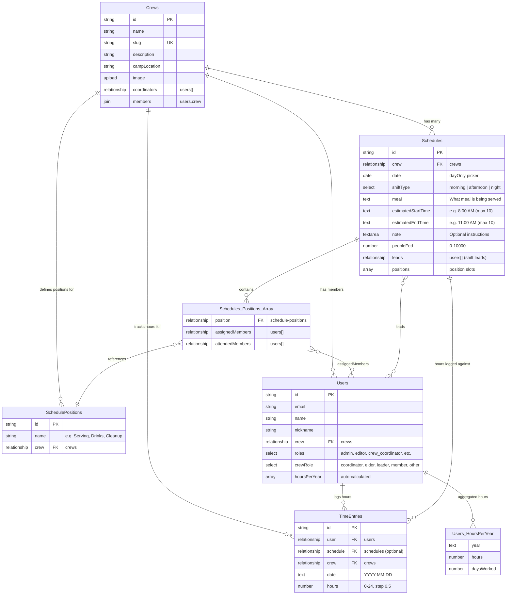

# Scheduling Data Model

The scheduling system uses several Payload CMS collections that work together to model shifts, positions, assignments, hours, events, and meal tracking.

## Entity Relationship Diagram

## Collection Details

### Crews

The top-level organizational unit. Every schedule, position, and time entry belongs to exactly one crew.

| Field | Type | Description |
|-------|------|-------------|
| `name` | text | Crew display name (required, max 100 chars) |
| `slug` | text | URL-friendly identifier, auto-generated from name |
| `description` | textarea | Optional crew description (max 2000 chars) |
| `campLocation` | text | Physical camp location (max 200 chars) |
| `image` | upload (media) | Crew profile image or banner |
| `coordinators` | relationship (users, hasMany) | Designated crew coordinators |
| `members` | join (users.crew) | Virtual field listing all crew members |

### SchedulePositions (`schedule-positions`)

Defines the types of positions available for shift sign-ups. Each crew manages its own list of positions.

| Field | Type | Description |
|-------|------|-------------|
| `name` | text | Position display name, e.g., "Serving", "Drinks" (required, max 100 chars) |
| `crew` | relationship (crews) | The crew this position belongs to (required, indexed) |

### Schedules

Represents a single shift on a specific date.

| Field | Type | Description |
|-------|------|-------------|
| `crew` | relationship (crews) | Which crew this shift belongs to (required, indexed) |
| `date` | date | The date of the shift, day-only picker (required, indexed) |
| `shiftType` | select | One of: `morning`, `afternoon`, `night` (required) |
| `meal` | text | What meal or event this shift covers (required, max 200 chars) |
| `estimatedStartTime` | text | Approximate start time, e.g., "8:00 AM" (max 10 chars, time format validated) |
| `estimatedEndTime` | text | Approximate end time, e.g., "11:00 AM" (max 10 chars, time format validated) |
| `note` | textarea | Optional instructions for volunteers (max 2000 chars) |
| `peopleFed` | number | Number of people fed during this shift (min 0, max 10,000). Displayed in sidebar. |
| `leads` | relationship (users, hasMany) | Users designated as leads for this shift |
| `positions` | array | Array of position slots, each containing a position reference, assigned members, and attended members |

Each element in the `positions` array has:

| Sub-field | Type | Description |
|-----------|------|-------------|
| `position` | relationship (schedule-positions) | Which position type this slot represents |
| `assignedMembers` | relationship (users, hasMany) | Users who have signed up for this slot |
| `attendedMembers` | relationship (users, hasMany) | Members who actually attended this position |

**Schedules Hooks:**
- **`beforeValidate`**: Auto-stamps the `crew` field from the authenticated user's profile.
- **`beforeChange`**: Non-admin users are forced to their own crew. Throws an error if a non-admin attempts to create a schedule for another crew.
- **`afterDelete`**: Creates an audit log entry (`schedule_deleted`) recording the date, meal, and shift type of the deleted schedule.

### TimeEntries (`time-entries`)

Records hours worked by a user, optionally linked to a specific shift.

| Field | Type | Description |
|-------|------|-------------|
| `user` | relationship (users) | Who performed the work (required, indexed) |
| `schedule` | relationship (schedules) | Optional link to a specific shift; blank for extra/manual hours |
| `crew` | relationship (crews) | Which crew this entry belongs to (required, indexed) |
| `date` | text | Date work was performed in `YYYY-MM-DD` format (required, indexed, validated) |
| `hours` | number | Hours worked, 0--24 range, 0.5 step increments (required) |

### ScheduleWeeks (`schedule-weeks`)

Controls draft/published status for a week of shifts. Non-privileged members cannot see shifts within a draft week.

| Field | Type | Description |
|-------|------|-------------|
| `crew` | relationship (crews) | Which crew this week belongs to (required, indexed) |
| `weekStart` | date | Start of the week, auto-normalized to crew's configured start day (required, indexed) |
| `status` | select | `draft` / `published` (required, default: `draft`) |
| `publishedAt` | date | When the week was published (auto-set, read-only) |
| `publishedBy` | relationship (users) | Who published (auto-set, read-only) |

### CrewEvents (`crew-events`)

Crew activities that appear on the schedule calendar alongside regular shifts.

| Field | Type | Description |
|-------|------|-------------|
| `title` | text | Event name (required, max 200 chars) |
| `date` | date | Event date (required, indexed) |
| `endDate` | date | Optional end date for multi-day events |
| `eventType` | select | `party` / `meeting` / `deadline` / `training` / `other` |
| `crew` | relationship (crews) | Owning crew (required, auto-set) |
| `allCrews` | checkbox | When true, visible to all crews |
| `rsvpEnabled` | checkbox | Whether RSVP is enabled |

### EventRsvps (`event-rsvps`)

RSVP responses for crew events.

| Field | Type | Description |
|-------|------|-------------|
| `event` | relationship (crew-events) | The event (required) |
| `user` | relationship (users) | The member (required, auto-set) |
| `status` | select | `going` / `maybe` / `not_going` |
| `crew` | relationship (crews) | Owning crew (required, auto-set) |

### EventPeriods (`event-periods`)

Named time periods for grouping meal logs and scheduling analytics.

| Field | Type | Description |
|-------|------|-------------|
| `name` | text | Period name (required, max 100 chars) |
| `startDate` | date | Period start (required) |
| `endDate` | date | Period end (required, must be >= startDate) |
| `crew` | relationship (crews) | Owning crew (required) |
| `year` | number | Year for grouping (required) |

### MealLogs (`meal-logs`)

Historical records of meals served, linked to schedule shifts.

| Field | Type | Description |
|-------|------|-------------|
| `schedule` | relationship (schedules) | The shift (required) |
| `crew` | relationship (crews) | Owning crew (required, auto-set) |
| `date` | date | Date served (required) |
| `peopleFed` | number | People fed (required, 0–10,000) |
| `meal` | text | Meal name (required) |
| `shiftType` | select | `morning` / `afternoon` / `night` |
| `period` | relationship (event-periods) | Optional event period |

## Automatic Aggregation

The `hoursPerYear` array on the User document is a read-only computed field. It is recalculated by the `recalcUserHours` function, which runs as both an `afterChange` and `afterDelete` hook on the TimeEntries collection. The function:

1. Fetches all time entries for the user
2. Groups them by year (extracted from the `date` field)
3. Sums `hours` and counts distinct days per year
4. Writes the result back to the user's `hoursPerYear` array using `overrideAccess: true`
