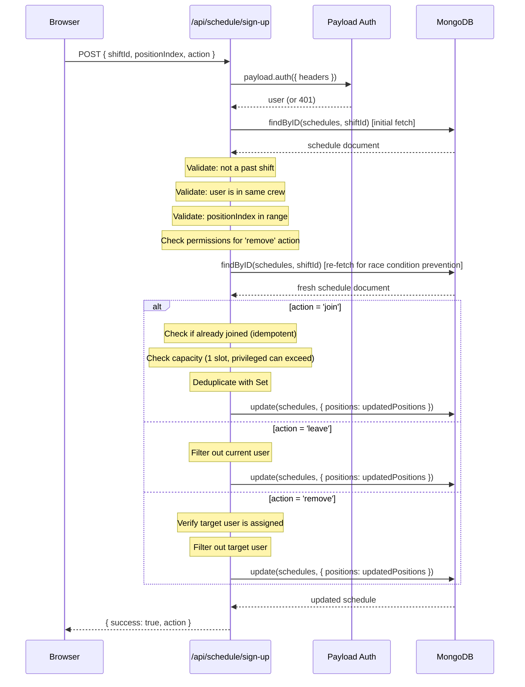

# Position Sign-Ups

The sign-up system allows crew members to claim open positions on shifts. It is implemented as a POST API route at `/api/schedule/sign-up`.

**Source**: `src/app/(app)/api/schedule/sign-up/route.ts`

## How Positions Work

Each shift has a `positions` array where each element contains:

- A **position** reference (e.g., "Serving", "Drinks") from the `schedule-positions` collection
- An **assignedMembers** array holding the users currently signed up for that slot

Each position slot nominally holds **one person**. Regular members cannot join a position that already has someone assigned. However, privileged users (admin, editor, crew_coordinator, crew_leader) can **double-staff** a position by joining even when someone is already assigned.

## Sign-Up Flow

The API accepts a POST request with the following JSON body:

```typescript
type RequestBody = {
  shiftId: string        // ID of the schedule document
  positionIndex: number  // Zero-based index into the positions array
  action: 'join' | 'leave' | 'remove'
  targetUserId?: string  // Required only for 'remove' action
}
```

### Actions

| Action | Description | Who Can Perform |
|--------|-------------|-----------------|
| `join` | Add the current user to the position's assignedMembers | Any authenticated crew member |
| `leave` | Remove the current user from the position's assignedMembers | The signed-up user themselves |
| `remove` | Remove a specific user (targetUserId) from the position | Privileged users or shift leads only |

## Sequence Diagram



## Validation and Guards

### Authentication

The route calls `payload.auth({ headers })` and returns 401 if no authenticated user is found.

### Past-Shift Guard

The API prevents modifications to past shifts by comparing date strings in UTC:

```typescript
const shiftDateStr = schedule.date.slice(0, 10)
const todayStr = new Date().toISOString().slice(0, 10)
if (shiftDateStr < todayStr) {
  return NextResponse.json({ error: 'Cannot modify sign-ups for past shifts' }, { status: 400 })
}
```

### Crew Membership Check

The user's crew ID must match the schedule's crew ID. If they do not match, the API returns a 403 error: *"Forbidden: not in this crew"*.

### Position Index Validation

The `positionIndex` must be a non-negative integer within the bounds of the schedule's positions array.

### Capacity Enforcement

Each position slot holds one person by default:

- If `freshMembers.length >= 1` and the user is **not** privileged, the API returns 409: *"This position is already filled."*
- Privileged users (admin, editor, crew_coordinator, crew_leader) can join even when the slot is occupied, enabling double-staffing.

### Idempotent Join

If the user is already in the position's `assignedMembers`, the API returns `{ success: true, action: 'already_joined' }` without modifying the document.

### Deduplication

On join, the updated members list is deduplicated using `new Set()` to guard against rapid duplicate submissions.

## Race Condition Prevention

The API uses a **double-read strategy** to minimize race conditions:

1. **First read**: Fetches the schedule to perform validation checks (past-shift guard, crew membership, permissions).
2. **Second read**: Re-fetches the schedule immediately before writing to get the freshest data. This minimizes the window between reading the current state and writing the update.

While this does not provide true transactional guarantees (MongoDB does not support optimistic locking on subdocuments), it reduces the race window to sub-millisecond levels, which is sufficient for the expected concurrency of crew scheduling.

## Authorization for Remove Action

The `remove` action requires the requesting user to be one of:

- An **admin**, **editor**, **crew_coordinator**, or **crew_leader** (checked via `checkRole`)
- A **shift lead** (listed in the schedule's `leads` array)

If neither condition is met, the API returns 403: *"Forbidden: insufficient permissions"*.

## Frontend Integration

The `ScheduleCalendar` component calls this API with optimistic UI updates:

1. Captures the previous state of the position's members
2. Immediately updates the UI with the expected result
3. Sends the API request
4. If the request fails, reverts the UI to the previous state and shows an error toast
