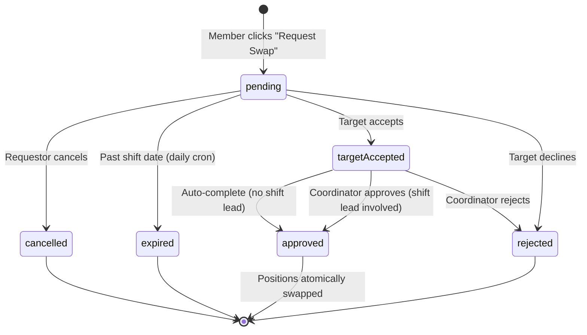

# Shift Swaps

The shift swap feature allows crew members to request a position trade with another member. Swaps go through a two-phase workflow: **target response** then **optional coordinator approval**.

## Workflow

1. **Requestor** opens a shift in Day view and clicks **Request Swap** next to their assigned position.
2. They select a **target member** and optionally add a message.
3. A `shift-swaps` document is created with `status: 'pending'`.
4. In-app notification (+ optional SMS) is sent to the target member.
5. The **target member** can **accept** or **decline** the request.
6. On **decline**: the swap is rejected and the requestor is notified.
7. On **accept**:
   - If **neither party is a shift lead** on the involved schedules, the swap **auto-completes** — positions are swapped immediately.
   - If **either party is a shift lead**, the swap is marked `targetAccepted: true` and stays pending for **coordinator approval**.
8. A **coordinator, leader, shift lead, or admin** can then approve or reject.
9. On **approval**: the two positions are atomically swapped — each member's name is moved to the other's position slot, across shifts if the swap is cross-shift.
10. On **rejection**: positions remain unchanged.
11. The **requestor can cancel** a pending swap at any time before it is completed.

## Auto-Expiry

Swap requests for past-date shifts are automatically expired by a daily cron job (`/api/cron/expire-shift-swaps`, runs at 1am UTC):

- Finds pending swaps where the shift date is in the past
- Updates status to `expired`
- Sends notifications to both parties (direct swaps) or requestor only (open swaps)
- API guards: approve/claim routes also reject past-date shifts and auto-expire the swap
- GET endpoint: direct swap route filters out past-date swaps from the response

## Swap Document Fields

| Field | Description |
|-------|-------------|
| `requestor` | User who initiated the swap |
| `targetMember` | User being asked to swap |
| `requestorShift` | Schedule document for the requestor's shift |
| `requestorPosition` | Position slot index in the requestor's shift |
| `targetShift` | Schedule document for the target's shift (may be same or different) |
| `targetPosition` | Position slot index in the target's shift |
| `status` | `pending` / `approved` / `rejected` / `cancelled` / `expired` |
| `targetAccepted` | Boolean — set to `true` when the target member accepts |
| `message` | Optional note from the requestor |
| `reviewedBy` | Coordinator, leader, shift lead, or admin who approved/rejected |
| `reviewedAt` | Timestamp of the review action |
| `crew` | Owning crew |

## Access Control

- Any confirmed crew member can **create** a swap request for a position they hold.
- The **requestor** can cancel their own pending request.
- **Coordinators, leaders, and admins** can approve or reject pending requests for their crew.
- **Shift leads** can approve or reject swaps involving shifts they lead.
- Members can view swap requests they are involved in (as requestor or target).
- Admins can view all swap requests.

## Cross-Shift Swaps

Swaps can be cross-shift — the requestor and target do not need to be on the same shift. When approved, each member is moved into the other's position on their respective shifts.

## Notifications

| Event | Notified parties |
|-------|-----------------|
| Swap requested | Target member |
| Target accepts (auto-complete) | Requestor (swap is done) |
| Target accepts (needs approval) | Requestor, crew coordinator |
| Target declines | Requestor |
| Swap approved by coordinator | Requestor, target member |
| Swap rejected by coordinator | Requestor |
| Swap cancelled | Target member |
| Swap expired | Requestor and target (direct) or requestor only (open) |

## Related

- [Shift Swaps Collection](../../collections/shift-swaps)
- [Scheduling Overview](./overview)
- [Notifications Feature](../notifications)
