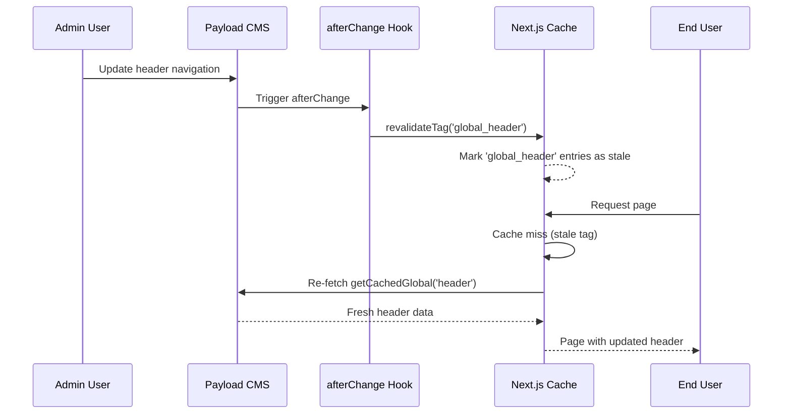

# Cache Revalidation

OCFCrews uses Next.js on-demand revalidation to ensure that cached content is updated immediately when the underlying data changes. Rather than waiting for time-based cache expiration, collection and global hooks trigger revalidation as soon as content is modified.

## Revalidation Mechanisms

Next.js provides two revalidation functions:

| Function | Scope | Use Case |
|----------|-------|----------|
| `revalidatePath(path)` | Invalidates cached data for a specific URL path | Pages with unique URLs (e.g., `/about`, `/home`) |
| `revalidateTag(tag)` | Invalidates all cached data associated with a tag | Shared data used across multiple pages (e.g., header, posts) |

## Global Revalidation

Each global configuration includes an `afterChange` hook that invalidates its cache tag when content is modified through the admin panel or API:

### Header

```typescript title="src/globals/Header.ts"
hooks: {
  afterChange: [({ doc }) => { revalidateTag('global_header'); return doc }],
}
```

When a navigation item is added, removed, or reordered in the header global, the `global_header` cache tag is invalidated. This causes `getCachedGlobal('header')` to re-fetch the data on the next request.

### Footer

```typescript title="src/globals/Footer.ts"
hooks: {
  afterChange: [({ doc }) => { revalidateTag('global_footer'); return doc }],
}
```

Same pattern as the header. Footer navigation changes immediately propagate to all pages.

### Settings

```typescript title="src/globals/Settings/index.ts"
hooks: {
  afterChange: [({ doc }) => { revalidateTag('global_settings'); return doc }],
}
```

Settings changes (such as toggling shop availability or account creation) take effect immediately.

## Collection Revalidation

### Pages Collection

The pages collection uses both `revalidatePath` and `revalidateTag` for thorough cache invalidation:

```typescript title="src/collections/Pages/hooks/revalidatePage.ts"
export const revalidatePage: CollectionAfterChangeHook<Page> = ({
  doc,
  previousDoc,
  req: { payload, context },
}) => {
  if (!context.disableRevalidate) {
    if (doc._status === 'published') {
      const path = doc.slug === 'home' ? '/' : `/${doc.slug}`
      payload.logger.info(`Revalidating page at path: ${path}`)
      revalidatePath(path)
      revalidateTag('pages')
    }

    // If the page was previously published, revalidate the old path
    if (previousDoc?._status === 'published' && doc._status !== 'published') {
      const oldPath = previousDoc.slug === 'home' ? '/' : `/${previousDoc.slug}`
      payload.logger.info(`Revalidating old page at path: ${oldPath}`)
      revalidatePath(oldPath)
      revalidateTag('pages')
    }
  }
  return doc
}

export const revalidateDelete: CollectionAfterDeleteHook<Page> = ({
  doc,
  req: { context },
}) => {
  if (!context.disableRevalidate) {
    const path = doc?.slug === 'home' ? '/' : `/${doc?.slug}`
    revalidatePath(path)
    revalidateTag('pages')
  }
  return doc
}
```

Key behaviors:
- **Published pages**: Both the specific path and the `pages` tag are revalidated
- **Unpublished pages**: If a page transitions from published to draft, the old path is revalidated to remove it from the cache
- **Deleted pages**: The path and tag are both revalidated
- **disableRevalidate context**: Hooks can be skipped by setting `context.disableRevalidate`, useful for bulk operations or seeding

### Posts Collection

Posts use tag-based revalidation since posts are displayed on listing pages and individual pages:

```typescript title="src/collections/Posts/index.ts"
const revalidatePostCache: CollectionAfterChangeHook = ({ doc, req: { context } }) => {
  if (!context.disableRevalidate) {
    revalidateTag('posts')
  }
  return doc
}

const revalidatePostDelete: CollectionAfterDeleteHook = ({ doc, req: { context } }) => {
  if (!context.disableRevalidate) {
    revalidateTag('posts')
  }
  return doc
}
```

The `posts` tag is shared by both `getCachedPublicPosts` and `getCachedPostBySlug` cached queries, so any post change invalidates both the listing and individual post caches.

## Revalidation Flow



## Complete Revalidation Map

| Source | Event | Revalidation Action | Affected Caches |
|--------|-------|-------------------|----------------|
| Header global | afterChange | `revalidateTag('global_header')` | Header navigation on all pages |
| Footer global | afterChange | `revalidateTag('global_footer')` | Footer navigation on all pages |
| Settings global | afterChange | `revalidateTag('global_settings')` | Shop status, account creation toggle |
| Pages collection | afterChange (publish) | `revalidatePath(path)` + `revalidateTag('pages')` | Specific page + page listings |
| Pages collection | afterChange (unpublish) | `revalidatePath(oldPath)` + `revalidateTag('pages')` | Old page URL + page listings |
| Pages collection | afterDelete | `revalidatePath(path)` + `revalidateTag('pages')` | Deleted page URL + page listings |
| Posts collection | afterChange | `revalidateTag('posts')` | Public post listings + individual posts |
| Posts collection | afterDelete | `revalidateTag('posts')` | Public post listings + individual posts |

## What Is NOT Cached

The following data is always fetched fresh (not cached via `unstable_cache`) because it is user-specific or changes frequently:

- **Schedule data**: Shift sign-ups change in real-time as crew members join/leave
- **Time entries**: Hours logged by individual users
- **Inventory data**: Stock levels change with every transaction
- **User profiles**: Personal data that must reflect the latest state
- **Crew-specific posts**: Visible only to authenticated crew members

These queries go directly through the Payload SDK (in-process, no HTTP overhead) and benefit from PostgreSQL indexes rather than application-level caching.

## Disabling Revalidation

All revalidation hooks check `context.disableRevalidate` before executing. This can be used to suppress revalidation during bulk operations:

```typescript
await payload.update({
  collection: 'pages',
  id: pageId,
  data: { ... },
  context: { disableRevalidate: true },
})
```

This is useful during database seeding, migrations, or batch updates where triggering revalidation for every individual change would be wasteful.
