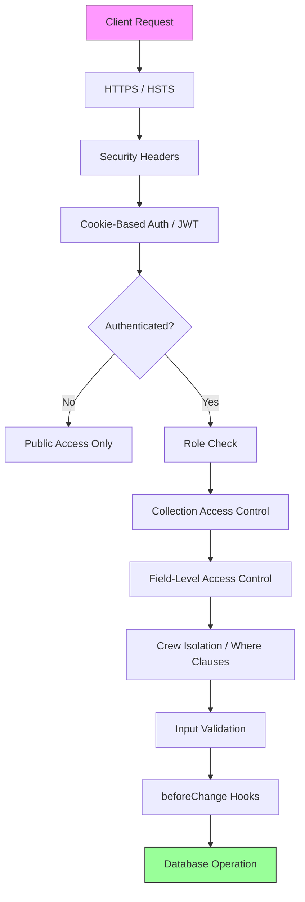

# Security Overview

OCFCrews implements a defense-in-depth security strategy with multiple overlapping layers of protection. Every request passes through several security checkpoints before data is served or modified.

## Security Architecture

## Security Layers Summary

### 1. Transport Security

All traffic is served over HTTPS with `Strict-Transport-Security` enforced via response headers. The HSTS header instructs browsers to always use HTTPS for subsequent requests, with a max-age of one year including subdomains.

### 2. Security Headers

Six security headers are applied to every response via `next.config.js`. These protect against MIME sniffing, clickjacking, XSS, referrer leakage, and unauthorized browser API access. See the [Security Headers](./security-headers.md) page for full details.

### 3. Cookie-Based Authentication with JWT

Payload CMS uses HTTP-only, secure cookies containing a JWT token for authentication. The token has a 14-day expiration (`tokenExpiration: 1209600` seconds). Authentication is verified server-side using `payload.auth({ headers })` in API routes.

### 4. Email Verification

New user accounts require email verification before gaining full access. Payload's built-in `auth.verify` configuration generates verification emails with unique tokens. A rate-limited resend endpoint prevents abuse (one request per 60 seconds per email address).

### 5. Role-Based Access Control (RBAC)

The system defines the following roles:

| Role | Scope |
|------|-------|
| `admin` | Full system access to all collections and operations |
| `editor` | Content management, user management within crew |
| `viewer` | Read-only admin panel access |
| `crew_coordinator` | Crew management, scheduling, email campaigns for own crew |
| `crew_elder` | Senior crew member role |
| `crew_leader` | Shift management and scheduling for own crew |
| `crew_member` | Self-service: sign up for shifts, log hours |
| `inventory_admin` | Full inventory management for own crew |
| `inventory_editor` | Create/update inventory items for own crew |
| `inventory_viewer` | Read-only inventory access for own crew |
| `shop_admin` | Full shop management (products, orders, transactions) |
| `shop_editor` | Create/update shop products and manage orders |
| `shop_viewer` | Read-only shop access |
| `other` | Default role for new/unassigned users |

Access control is enforced at three levels:
- **Collection-level**: Controls who can create, read, update, and delete documents
- **Field-level**: Controls who can read or write specific fields within a document
- **Where-clause filtering**: Limits query results to only documents the user is authorized to see

See the [Access Control Matrix](./access-control-deep-dive.md) for the complete breakdown.

### 6. Crew Isolation

Most collections use MongoDB `Where` clause filters to ensure users can only access data belonging to their own crew. The `crew` field is indexed on nearly every collection to support efficient filtered queries. Non-admin users cannot create, read, or modify documents belonging to other crews. Server-side `beforeChange` hooks enforce this by stamping the authenticated user's crew ID on every write operation.

### 7. Input Validation

All user inputs are validated at multiple levels:
- **Payload field constraints**: `required`, `maxLength`, `minLength`, `min`, `max`, `unique`
- **Custom validators**: Regex patterns for dates (`YYYY-MM-DD`), phone numbers, slugs, email subjects
- **API route validation**: Type checking, range validation, `isFinite` checks, action whitelists
- **Rich text**: Lexical editor with a controlled feature set (no arbitrary HTML injection)

See the [Input Validation](./input-validation.md) page for specifics.

### 8. Email Injection Prevention

Email sending is secured through recipient resolution from the database (not user input), header sanitization to strip control characters, batch size limits (10 per batch, 500-1000 max recipients), and coordinator restrictions on recipient types. See the [Email Injection Prevention](./email-injection-prevention.md) page for details.

### 9. CSRF Protection

CSRF is mitigated through Payload's built-in cookie configuration with `SameSite` attributes, cookie-based authentication that requires the browser to include credentials, and server-side auth verification on every API route. See the [CSRF Protection](./csrf-protection.md) page for implementation details.

### 10. GraphQL Playground Disabled in Production

The GraphQL playground is explicitly disabled in production via `graphQL.disablePlaygroundInProduction: true` in the Payload configuration, preventing interactive exploration of the API schema on deployed instances.

### 11. Additional Safeguards

- **Past-shift guard**: Users cannot modify sign-ups for shifts that have already occurred (date comparison in UTC)
- **Time entry age limit**: Non-admin users cannot create or edit time entries older than 14 days
- **Shift assignment verification**: Users can only log hours for shifts they are actually assigned to
- **Account creation toggle**: Administrators can disable public account creation via the Global Settings
- **Role escalation prevention**: Non-admin users cannot assign the `admin` role to themselves or others
- **Crew reassignment prevention**: Non-admin users cannot remove a user's crew assignment
- **Password change restriction**: Only admin and editor roles can change user passwords
